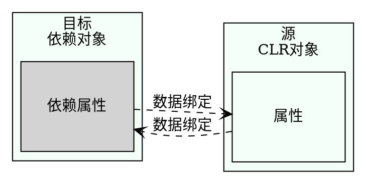

## 数据绑定
对于基于XAML的应用程序来说，数据绑定是一个极其重要的概念。数据绑定把数据从.NET对象传递给UI，或从UI传递给.NET对象。

简单对象可以绑定到UI元素、对象列表和XAML元素上。在数据绑定中，目标可以是XAML元素的任意依赖属性，CLR对象的每个属性都可以是绑定源。因为XAML元素也提供了.NET属性，所以每个XAML元素也可以用作绑定源。下图显示了绑定源和绑定目标之间的连接。绑定定义了该连接。

Binding对象支持源与目标之间的几种绑定模式。绑定可以是单向的，即从源信息指向目标，但如果用户在用户界面上修改了该信息，则原不会更新。要更新源，需要双向绑定。



<table>
  <th>绑定模式</th>
  <th>说明</th>
  <!--下一行-->
  <tr>
    <td>
      一次性   
    </td>
    <td>
      绑定从源指向目标，且仅在应用程序启动时，或数据上下文改变时绑定一次。通过这种模式可以获得数据的快照。
    </td>
  </tr>
<!--下一行-->
<tr>
  <td>单向</td>
  <td>
    绑定从源指向目标。这对于只读属性很有用，因为他不能从用户界面修改数据。要更新用户界面，源必须实现INotifyPropertyChanged接口。
  </td>
</tr>
<!--下一行-->
<tr>
  <td>双向</td>
  <td>
    用户可以从UI中修改数据。绑定是双向的——从源指向目标，从目标指向源。源对象需要实现读\写属性，才能把改动的内容从UI更新到源对象上。
  </td>
</tr>
<!--下一行-->
<tr>
  <td>指向源的单向</td>
  <td>
    采用这种模式，如果目标属性改变，源对象也会更新。这种绑定不能用于UWP，但可以用于WPF和Xammarin。
  </td>
</tr>
</table>

==注意：UWP支持两种绑定类型：使用Binding标记扩展的传统绑定，以及使用x:Bind标记扩展的新编译绑定。请注意，绑定模式的默认值在这些绑定类型之间存在差异，因此最好总是指定绑定模式。本节关注编译绑定==

除了绑定模式之外，数据绑定还涉及许多方面。本节详细介绍与简单的.NET对象和列表的绑定。通过更改通知，可以使用绑定对象中的更改更新UI。本节也将论述如何动态地选择数据模板。

下面从DataBindingSamples示例应用程序开始。该应用程序显示图书列表，并允许用户选择一本书，来查看图书细节。


### 用INotifyPropertyChanged更改通知
首先创建模型。为了在属性值变化时把更改信息传递给用户界面，必须实现INotifyPropertyChanged接口。为了重用此实现代码，创建实现此接口的BindableBase类。
该接口定义了PropertyChanged事件处理程序，该事件在OnPropertyChanged方法中触发。方法set用于更改属性值，并触发PropertyChanged事件。

如果要设置的值与当前值没有不同，则不触发事件，且方法仅返回false。只有使用不同的值是，属性才设置为新值，并触发PropertyChanged事件。这个方法在C#编译器就会通过这个参数传递属性名，所以不需要在代码中添加硬编码字符串。
```csharp
using System;
using System.Collections.Generic;
using System.ComponentModel;
using System.Linq;
using System.Runtime.CompilerServices;
using System.Text;
using System.Threading.Tasks;

namespace WinTest.Models
{
    public class BindableBase : INotifyPropertyChanged
    {
        public event PropertyChangedEventHandler PropertyChanged;

        public virtual bool Set<T>(ref T item, T value, [CallerMemberName] string propertyName = null)
        {
            if (EqualityComparer<T>.Default.Equals(item, value)) return false;
            item = value;
            OnPropertyChanged(propertyName);
            return true;
        }

        protected virtual void OnPropertyChanged(string propertyName) =>
            PropertyChanged?.Invoke(this, new PropertyChangedEventArgs(propertyName));
    }
}


//---------------------------------------------------------------
//Book类派生自基类BindableBase，并实现了属性BookId、Title、Publisher和Authors。
//BookId属性时只读的；
//Title和Publisher使用来自基类的变更通知实现；
//Author是一个只读属性，返回作者列表。
using System;
using System.Collections.Generic;
using System.Linq;
using System.Text;
using System.Threading.Tasks;

namespace WinTest.Models
{
    public class Book:BindableBase
    {

        public int BookId { get; }
        
        
        private string _title;
        public string Title
        {
            get => _title;
            set => Set(ref _title, value);
        }

        private string _publisher;
        public string Publisher
        {
            get => _publisher;
            set => Set(ref _publisher, value);
        }

        public IEnumerable<string> Authors { get; set; }

        public override string ToString() => Title;

        public Book(int id,string title,string publisher,params string[] authors)
        {
            BookId = id;
            Title = title;
            Publisher = publisher;
            Authors = authors;
        }
    }
}
```


### 创建图书列表
GetSampleBooks方法返回应使用Book类的构造函数显示的图书列表。
```csharp
using System;
using System.Collections.Generic;
using System.Linq;
using System.Text;
using System.Threading.Tasks;
using WinTest.Models;

namespace WinTest.Services
{
    public class SampleBooksService
    {
        public IEnumerable<Book> GetSampleBooks() =>
            new List<Book>()
            {
                new Book(1,"乌合之众","今日出版社","斯密斯.赵峰"),
                new Book(1,"九霄云外的惊变","无知出版社","尼古拉斯.雅淇"),
                new Book(1,"大众点评","机械工业出版社","亚当斯"),
                new Book(1,"仓求咧积分","清华出版社","索罗斯"),
                new Book(1,"苍穹之下宗盛","无敌份额出版社","麦克.贾克斯")
            };
    }
}


//现在BooksService提供了RefreshBooks、GetBook、AddBook方法以及属性Books。属性Books返回一个ObservableCollection<Book>对象。
//ObservableCollection是一个泛型类，通过实现接口INotifyCollectionChanged来提供更改通知。

using System;
using System.Collections.Generic;
using System.Collections.ObjectModel;
using System.Linq;
using System.Text;
using System.Threading.Tasks;
using WinTest.Models;

namespace WinTest.Services
{
    public class BooksService
    {
        private ObservableCollection<Book> _books = new ObservableCollection<Book>();

        public void RefreshBooks()
        {
            _books.Clear();
            var sampleBooksService = new SampleBooksService();
            var books = sampleBooksService.GetSampleBooks();
            foreach(var book in books)
            {
                _books.Add(book);
            }
        }

        public Book GetBook(int bookId) =>
            _books.Where(b => b.BookId == bookId).SingleOrDefault();

        public void AddBook(Book book) => _books.Add(book);

        public IEnumerable<Book> Books => _books;
    }
}
```


### 列表绑定
现在可以显示图书列表了。可以使用任何ItemsSource派生控件指定ItemsSource属性，绑定到列表上。下面的代码片段使用ListView控件将ItemsSource绑定到Books属性上。使用标记扩展x:Bind时，指定的第一个名称是绑定的源，Mode参数确定了绑定模式。对于OneWay，当消息源发生变化时，UWP利用变更通知来更新用户界面：
```csharp
<ListView ItemsSource="x:Bind Books,Mode=OneWay" Grid.Row="1">
```
代码隐藏文件中，指定Books属性以引用BooksService的Books属性。
```csharp
using System;
using System.Collections.Generic;
using System.Globalization;
using System.Linq;
using Windows.UI;
using Windows.UI.Popups;
using Windows.UI.Xaml;
using Windows.UI.Xaml.Controls;
using WinTest.Services;
using WinTest.Models;


// https://go.microsoft.com/fwlink/?LinkId=402352&clcid=0x804 上介绍了“空白页”项模板

namespace WinTest
{
    /// <summary>
    /// 可用于自身或导航至 Frame 内部的空白页。
    /// </summary>
    public sealed partial class MainPage : Page
    {
        public MainPage()
        {
            this.InitializeComponent();
        }

        private BooksService _booksService = new BooksService();

        public IEnumerable<Book> Books => _booksService.Books;
    }
}
```

### 把事件绑定到方法
如果没有在BooksService中调用RefreshBooks方法，列表将为空。
使用XAML文件，会创建一个CommandBar，其中列出两个AppBarButton控件。
通过AppBarButton控件，Click事件再次绑定到OnRefreshBooks和OnRefresh方法上。
```csharp
//--MainPage.xaml
    <Grid Background="{ThemeResource ApplicationPageBackgroundThemeBrush}">
        <Grid.RowDefinitions>
            <RowDefinition Height="auto"/>
            <RowDefinition Height="*"/>
        </Grid.RowDefinitions>
        <Grid.ColumnDefinitions>
            <ColumnDefinition Width="auto"/>
            <ColumnDefinition Width="*"/>
        </Grid.ColumnDefinitions>
        <CommandBar Grid.Row="0" Grid.Column="0" Grid.ColumnSpan="2">
            <AppBarButton Icon="Refresh" Label="Refresh" Click="{x:Bind OnRefreshBooks}"/>
            <AppBarButton Icon="Add" Label="Add Book" Click="{x:Bind OnAddBook}"/>
        </CommandBar>
        <ListView ItemsSource="x:Bind Books,Mode=OneWay" Grid.Row="1">
    </Grid>


//------------------------------------------------------------------
// MainPage.xaml.cs
using System;
using System.Collections.Generic;
using System.Globalization;
using System.Linq;
using Windows.UI;
using Windows.UI.Popups;
using Windows.UI.Xaml;
using Windows.UI.Xaml.Controls;
using WinTest.Services;
using WinTest.Models;


// https://go.microsoft.com/fwlink/?LinkId=402352&clcid=0x804 上介绍了“空白页”项模板

namespace WinTest
{
    /// <summary>
    /// 可用于自身或导航至 Frame 内部的空白页。
    /// </summary>
    public sealed partial class MainPage : Page
    {
        public MainPage()
        {
            this.InitializeComponent();
        }

        private BooksService _booksService = new BooksService();

        public IEnumerable<Book> Books => _booksService.Books;

        public void OnRefreshBooks() => _booksService.RefreshBooks();

//如果方法没有参数或具有事件的委托类型指定的参数，则可以将时间绑定到方法。在以下代码中，OnRefreshBooks和OnAddBook方法声明为void，没有参数。
       
        public void OnAddBook() =>
            _booksService.AddBook(new Book(GetNextBookId(),$"不知道{GetNextBookId()+3}","工业出版社"));

        public int GetNextBookId()=>Books.Select(b=>b.BookId).Max()+1;
    }
}
```
==注意：绑定到方法上只能使用x:Bind标记扩展，不能使用传统的Binding标记扩展==

正在运行的应用程序带有两个AppBar按钮，单击Refresh按钮加载图书，并显示图书标题，因为Book类的ToString方法返回标题。单击Add按钮会创建一个新的Book对象，该对象会出现在列表中，因为列表的类型是ObservableCollection。
ObservableCollection通过接口INotifyCollectionChanged实现了更改通知。


<br>
<hr>

### 使用数据模板和数据模板选择器
为了创建不同的项外观，可以创建一个DataTemplate。可以使用x:key特性指定的键引用DataTemplate。使用x:DateType特性时，可以在数据模板中使用已经编译绑定。已编译绑定需要在编译时绑定到的类型。要绑定到Title属性，类型由Book类定义。
```csharp
<Page.Resources>
  <DataTemplate x:DataType="models:Book" x:Key="WroxTemplate">
    <Border Background="Red" Margin="4" Padding="4" BorderThickness="2" BorderBrush="DarkRed">
      <TextBlock Text="{x:Bind Title,Mode=OneWay}" Foreground="White" Width="300">
    </Border>
  </DataTemplate>

  <DataTemplate x:DataType="models:Book" x:Key="DefaultTemplate">
      <Border Background="LightBlue" Margin="4 " Padding="4"          BorderThickness="2"
        BorderBrush="DarkBlue">
       <TextBlock Text="{x:Bind Title,Mode=OneWay}" Foreground="Yellow" Width="300"/>
     </Border>
 </DataTemplate>
</Page.Resources>
```

在ItemsControl中使用的数据模板可以使用ItemsControl的ItemTemplate属性来引用。现在使用DataTemplateSelector，根据出版社的名称动态选择DataTemplate，而不是指定DataTemplate。

BookDataTemplateSelector派生自基类DataTemplateSelector。数据模板选择器需要重写方法SelectTemplateCore并返回所选择的DataTemplate。在实现BookTemplateSelector时，指定了两个属性WroxTemplate和DefaultTemplate。
在SelectTemplateCore方法中，会接收Book对象。可以使用牧师匹配与switch语句，这样，如果出版社时WroxPress，则返回WroxTemplate。在其他情况下，会返回DefaultTemplate。可以使用更多的出版社扩展switch语句。
```csharp
    public class BookTemplateSelector:DataTemplateSelector
    {
        public DataTemplate WroxTemplate { get; set; }

        public DataTemplate DefaultTemplate { get; set; }

        protected override DataTemplate SelectTemplateCore(object item)
        {
            DataTemplate selectedTemplate = null;
            switch (item)
            {
                case Book b when b.Publisher == "Wrox Press":
                    selectedTemplate = WroxTemplate;
                    break;
                default:
                    selectedTemplate = DefaultTemplate;
                    break;
            }
            return selectedTemplate;
        }

    }

//-----------------------------------------------------------------
            <ListView ItemsSource="{x:Bind Books,Mode=OneWay}"
                  ItemTemplateSelector="{StaticResource BookTemplateSelector}"/>
//为了将BookTemplateSelector与ListView中的项一起使用。ItemTemplateSelector属性使用键和StaticResource标记扩展来引用模板。
```


<<<<<<< HEAD
### 绑定简单对象
不只是绑定列表，单本书应该显示在应用程序右边。已编译绑定用于绑定Book对象的BookId、Title和Publisher属性。
=======


### 导航
如果应用程序是由多个页面组成的，就需要能在这些页面之间导航。有不同的应用程序结构需要导航，比如使用汉堡包按钮导航到不同的根页面，或者使用不同的选项卡和替换选项卡。
如果需要为用户提供导航的方法，导航的核心是Frame类。Frame类允许使用Navigate方法，选择性的传递参数，导航到具体的页面。Frame类有一个要导航的页面堆栈，因此可以后退、前进，限制堆栈中页面的数量等。
导航的一个重要方面就是能返回。

#### 导航回最初的页面
下面开始创建一个有多个页面的Windows应用程序，在页面之间导航。模板生成的代码在App类中包含OnLaunched方法，该方法中，实例化一个Frame对象，再调用Navigate方法，导航到MainPage。（PageNavigation/App.xaml.cs）
```csharp
        protected override void OnLaunched(LaunchActivatedEventArgs e)
        {
            Frame rootFrame = Window.Current.Content as Frame;

            // 不要在窗口已包含内容时重复应用程序初始化，
            // 只需确保窗口处于活动状态
            if (rootFrame == null)
            {
                // 创建要充当导航上下文的框架，并导航到第一页
                rootFrame = new Frame();

                rootFrame.NavigationFailed += OnNavigationFailed;

                if (e.PreviousExecutionState == ApplicationExecutionState.Terminated)
                {
                    //TODO: 从之前挂起的应用程序加载状态
                }

                // 将框架放在当前窗口中
                Window.Current.Content = rootFrame;
            }

            if (e.PrelaunchActivated == false)
            {
                if (rootFrame.Content == null)
                {
                    // 当导航堆栈尚未还原时，导航到第一页，
                    // 并通过将所需信息作为导航参数传入来配置
                    // 参数
                    rootFrame.Navigate(typeof(MainPage), e.Arguments);
                }
                // 确保当前窗口处于活动状态
                Window.Current.Activate();
            }
        }
```
Frame类有一个已访问的页面堆栈。GoBack方法可以在这个堆栈中回航（如果CanGoBack属性返回true），GoForward方法可以在后退后前进到下一页。Frame类还提供了几个导航事件，如Navigating、Navigated、NavigationFalied和NavigationStopped。

为了查看导航操作，除了MainPage之外，还创建SecondPage和ThirdPage页面，在这些页面之间导航。在MainPage上，可以导航到SecondPage，通过传递一些数据可以从SecondPage导航到ThirdPage。

因为这些页面之间的通用功能，所以创建一个基类NavigationPage，所有这些页面都派生自它。NavigationPage类派生自基类Page，实现了接口INotifyPropertyChanged，用于更新用户界面。（PageNavigation/NavigationPage.cs）

```csharp
using System;
using System.Collections.Generic;
using System.ComponentModel;
using System.Linq;
using System.Runtime.CompilerServices;
using System.Text;
using System.Threading.Tasks;
using Windows.UI.Core;
using Windows.UI.Xaml.Controls;
using Windows.UI.Xaml.Navigation;

namespace WinTest
{
    public abstract class NavigationPage : Page, INotifyPropertyChanged
    {
        public event PropertyChangedEventHandler PropertyChanged;

        protected virtual void OnPropertyChanged(
            [CallerMemberName] string propertyName = null) =>
            PropertyChanged?.Invoke(this, new PropertyChangedEventArgs(propertyName));

        protected bool SetProperty<T>(ref T item, T value, [CallerMemberName] string propertyName = null)
        {
            if (EqualityComparer<T>.Default.Equals(item, value)) return false;
            item = value;
            OnPropertyChanged(propertyName);
            return true;
        }


        private string _navigationMode;
        public string NavigationMode
        {
            get => _navigationMode;
            set => SetProperty(ref _navigationMode, value);
        }


        protected override void OnNavigatedTo(NavigationEventArgs e)
        {
            NavigationMode = $"Navigation Mode: {e.NavigationMode}";
            SystemNavigationManager.GetForCurrentView().AppViewBackButtonVisibility = Frame.CanGoBack ? AppViewBackButtonVisibility.Visible : AppViewBackButtonVisibility.Collapsed;

            base.OnNavigatedTo(e);
        }

        protected override void OnNavigatingFrom(NavigatingCancelEventArgs e)
        {
            base.OnNavigatingFrom(e);
        }

        protected override void OnNavigatedFrom(NavigationEventArgs e)
        {
            base.OnNavigatedFrom(e);
        }
    }
}

```


#### 重写Page类的导航
Page类是NavigationPage的基类（也是XAML页面的基类），该类定义了用于导航的方法。当导航到相应的页面时，会调用OnNavigatedTo方法。在这个页面中，可以看到导航是如何操作的（NavigationMode属性）和导航参数。OnNavigationFrom方法是从页面中退出时调用的第一个方法。

在这里，导航可以取消。从这个页面中退出时，最终调用的是OnNavigatedFrom方法。在这里应该清理OnNavigatedTo方法分配的资源。

```csharp
public abstract class NavigationPage:Page,INotifyPropertyChanged
{
    protected override void OnNavigatedTo(NavigationEventArgs e)
    {
        base.OnNavigatedTo(e);
        NavigationMode=$"Navigation Mode:{e.NavigationMode}";
        //...
    }


    protected override void OnNavigatingFrom(NavigatingCancelEventArgs e)
    {
        base.OnNavigationFrom(e);
    }


    protected override void OnNavigatedFrom(NavigationEventArgs e)
    {
        base.OnNavigatedFrom(e);
    }
}

```


#### 在页面之间导航
下面三个页面，为了使用NavigationPage类，代码隐藏文件需要修改，以使用NavigationPage作为基类。
```csharp
public sealed partial class MainPage:NavigationPage
{
    //...
}

//基类的变化也需要反映在XAML文件中，使用NavigationPage元素代替Page
<local:NavigationPage>
</local>

//MainPage包含一个TextBlock元素和一个Button控件，TextBlock元素绑定到BasePage中声明的NavigationMode属性上，按钮的Click事件绑定到OnNavigateToSecondPage方法上。
<TextBlock Text="{x:Bind NavigationMode,Mode=OneWay}">

//处理程序方法OnNavigateToSecondPage使用Frame.Navigate导航到SecondPage。

//Frame是Page类上返回Frame实例的一个属性。

public void OnNavigateToSecondPage()
{
    Frame.Navigate(typeof(SecondPage))
}


//当从SecondPage导航到ThirdPage时，把一个参数传递给目标页面。参数可以在绑定到Data属性的文本框中输入。
<TextBox Header="Data" Text="{x:Bind Data,Mode=TwoWay}">
<Button Content="navigate to Third Page" 
    Click="{x:Bind OnNavigateToThirdPage,Mode=OneTime}">

//在代码隐藏文件中，将Data属性传递给Navigate方法。
public string Data{get;set;}
public ovid OnNavigateToThirdPage()
{
    Frame.Navigate(typeof(ThirdPage),Data);
}

//接受到参数在ThirdPage中检索。在OnNavigatedTo方法中，NavigationEventArgs用Parameter属性接收参数。Parameter属性是object类型，可以给页面导航传递任何数据。

protected override void OnNavigatedTo(NavigationEventArgs e)
{
    base.OnNavigatedTo(e);
    Data=e.Parameter as string ;
}

private string _data;
public string Data
{
    get=>_data;
    set=>SetProperty(ref _data,value);
}
```

#### 后退按钮
当应用程序中有导航要求时，必须包括返回的方式。在Windows8中，定制的后退按钮位于页面的左上角。在Windows10中仍然可以这样做。
要启动这个后退按钮，需要把SystemNavigationManager的AppViewBackButtonVisibility设置为AppViewBackButton Visibility，在下面的代码中，Frame.CanGoBack属性返回true时，就是这种情况。
```csharp
protected override void OnNavigatedTo(NavigationEventArgs e)
{
    NavigationMode=$"Navigation Mode:{e.NavigationMode}";
    SystemNavigationManager.GetForCurrentView().AppViewBackButtonVisibility=
    Frame.CanGoBack ? AppViewBackButtonVisibility.Visible:
    AppViewBackButtonVisibility.Collapsed;

    base.OnNavigatedTo(e);
}

//接下来，使用SystemNavigationManager类的BackRequested事件。对BackRequestedEvent的响应可以用于完整的应用程序。如果在这几页上显示这个功能，还可以把这段代码放大噢耶面的OnNavigatedTo方法中。

// app.xaml.cs
        protected override void OnLaunched(LaunchActivatedEventArgs e)
        {
            //...
            SystemNavigationManager.GetForCurrentView().BackRequested +=
                App_BackRequested;
            Window.Current.Activate();
        }

        private void App_BackRequested(object sender,BackRequestedEventArgs e)
        {
            Frame rootFrame = Window.Current.Content as Frame;
            if (rootFrame == null) return;
            if (rootFrame.CanGoBack && e.Handled == false)
            {
                e.Handled = true;
                rootFrame.GoBack();
            }
        }

```

在桌面模式中运行这个应用程序时，可以看到后退按钮位于上边界的左边。如果应用程序在平板模式下运行，边界是不可见的，但后退按钮显示在底部边界Windows按钮的旁边。


<br>
<hr>

### Hub
 也可以让用户使用Hub控件在单个页面的内容之间导航。这里可以使用的一个例子是，希望显示一个图像，作为应用程序的入口点，用户滚动时显示更多信息（参见Store的照片搜索应用程序）。

 使用Hub控件可以定义多个部分。每个部分有标题和内容。也可以让标题可以单击，例如，单行到详细信息页面上。以下代码示例定义了一个Hub控件，在其中可以单击部分2和部分3的标题。单击某部分的标题时，就调用Hub控件的SectionHeaderClick事件指定的方法。每个部分都包含一个标题和一些内容。部分的内容由DataTemplate定义(NavigationControls/HubPage.xaml)。
 ```csharp

 // HubPage.xaml
    <Grid>
        <Hub Background="{ThemeResource ApplicationPageBackgroundThemeBrush} "
             SectionHeaderClick="{x:Bind OnHeaderClick}">
            <Hub.Header>
                <StackPanel Orientation="Vertical">
                    <TextBlock>Hub Header</TextBlock>
                    <TextBlock Text="{x:Bind Info,Mode=TwoWay}"/>
                </StackPanel>
            </Hub.Header>

            <HubSection Width="400" Background="LightBlue" Tag="section1">
                <HubSection.Header>
                    <TextBlock>Section 1 Header</TextBlock>
                </HubSection.Header>
                <DataTemplate>
                    <TextBlock>Section 1</TextBlock>
                </DataTemplate>
            </HubSection>

            <HubSection Width="300" Background="LightGreen" IsHeaderInteractive="True"
                        Tag="Section2">
                <HubSection.Header>
                    <TextBlock>Section 2 Header</TextBlock>
                </HubSection.Header>
                <DataTemplate>
                    <TextBlock>Section 2</TextBlock>
                </DataTemplate>
            </HubSection>

            <HubSection Width="300" Background="LightGoldenrodYellow" IsHeaderInteractive="True" 
                        Tag="section3">
                <HubSection.Header>
                    <TextBlock>Section Header</TextBlock>
                </HubSection.Header>
                <DataTemplate>
                    <TextBlock>Section 3</TextBlock>
                </DataTemplate>
            </HubSection>
        </Hub>
    </Grid>

// HubPage.xaml.cs
using System;
using System.Collections.Generic;
using System.Linq;
using System.Text;
using System.Threading.Tasks;
using Windows.UI.Core;
using Windows.UI.Xaml;
using Windows.UI.Xaml.Controls;
using Windows.UI.Xaml.Navigation;

namespace WinTest
{
    public sealed partial class HubPage:Page
    {
        public HubPage()
        {
            this.InitializeComponent();
        }

        protected override void OnNavigatedTo(NavigationEventArgs e)
        {
            SystemNavigationManager.GetForCurrentView().AppViewBackButtonVisibility =
                AppViewBackButtonVisibility.Visible;
        }

        public void OnHeaderClick(object sender,HubSectionHeaderClickEventArgs e)
        {
            Info = e.Section.Tag as string;
        }

// 单击标题部分时，Info依赖属性就指定Tag属性的值。Info属性绑定在Hub控件的标题上。

        public string Info
        {
            get => (string)GetValue(InfoProperty);
            set => SetValue(InfoProperty, value);
        }

        public static readonly DependencyProperty InfoProperty =
            DependencyProperty.Register("Info", typeof(string),
                typeof(HubPage), new PropertyMetadata(string.Empty));
    }
}


//MainPage.xaml
    <Grid Background="{ThemeResource ApplicationPageBackgroundThemeBrush}">
        <StackPanel>
            <Button Click="{x:Bind OnGotoHub}">Hub</Button>
        </StackPanel>
    </Grid>

//MainPage.xaml.cs
        public void OnGotoHub()
        {
            Frame.Navigate(typeof(HubPage));
        }
 ```
 单击标题部分时，Info依赖属性就指定Tag属性的值。Info属性绑定在Hub控件的标题上。
 运行这个应用程序时，可以看到多个Hub部分，在部分2和部分3上有see More链接。因为在这些部分中，将IsHeaderinteractive
设置为true。当然，可以创建一个定制的标题的模板，给标题指定不同的外观。


### Pivot
>>>>>>> 25199278a888fa6cd8f39714561ff75c470fce88
使用Pivot控件可以为导航创建类似枢轴的外观。Pivot控件可以包含多个PivotItem控件。每个PivotItem控件都有一个标题和内容。Pivot本身包含左右标题。示例代码填充了右标题。
```csharp
// Pivot.xaml
    <Pivot Title="Pivot Sample" Background="{ThemeResource ApplicationPageBackgroundThemeBrush}">
        <Pivot.RightHeader>
            <StackPanel>
                <TextBlock>右标题</TextBlock>
            </StackPanel>
        </Pivot.RightHeader>

        <PivotItem>
            <PivotItem.Header>pivot 1 的标题</PivotItem.Header>
            <TextBlock> pivot 1的内容</TextBlock>
        </PivotItem>

        <PivotItem>
            <PivotItem.Header>pivot 2 的标题</PivotItem.Header>
            <TextBlock> pivot 2的内容</TextBlock>
        </PivotItem>

        <PivotItem>
            <PivotItem.Header>pivot 3 的标题</PivotItem.Header>
            <TextBlock> pivot 3的内容</TextBlock>
        </PivotItem>

        <PivotItem>
            <PivotItem.Header>pivot 4 的标题</PivotItem.Header>
            <TextBlock> pivot 4的内容</TextBlock>
        </PivotItem>
    </Pivot>

//Pivot.xaml.cs

using System;
using System.Collections.Generic;
using System.Linq;
using System.Text;
using System.Threading.Tasks;
using Windows.UI.Core;
using Windows.UI.Xaml.Controls;
using Windows.UI.Xaml.Navigation;

namespace WinTest
{
    public sealed partial class PivotPage:Page
    {
        public PivotPage()
        {
            this.InitializeComponent();
        }


        //显示系统后退按钮
        protected override void OnNavigatedTo(NavigationEventArgs e)
        {
            SystemNavigationManager.GetForCurrentView().AppViewBackButtonVisibility =
                AppViewBackButtonVisibility.Visible;
        }
    }
}

//MainPage.xaml
    <Grid Background="{ThemeResource ApplicationPageBackgroundThemeBrush}">
        <StackPanel>
            <Button Click="{x:Bind OnGotoHub}">Hub</Button>
            <Button Click="{x:Bind OnGotoPivot}">Pivot</Button>
        </StackPanel>
    </Grid>

//ManPage.xaml.cs
        public void OnGotoPivot()
        {
            Frame.Navigate(typeof(PivotPage));
        }
```
如果所有标题不符合屏幕大小，用户就可以滚动。使用鼠标进行导航，可以看到左右边的箭头。


### NavigationView
Windows 10应用程序通常使用SplitView控件和汉堡包按钮用于打开菜单列表。菜单列表会显示为一个图标，如果没有更多可用的空间，菜单就显示图标和文本。为了给内容和菜单安排空间，SplitView控件开始发挥作用。

SplitView为窗格和内容提供了空间，其中窗格通常包含菜单项。窗格可以有一个小尺寸和一个大尺寸，可以根据可用的屏幕大小对其进行配置。
可以使用NavigationView控件将所欲这些行为集成到一个控件中。单击汉堡包按钮或缩小应用程序，将窗格更改为紧凑模式，进一步减小应用程序的大小，将NavigationView的左侧部分减少为汉堡包按钮。


NavigationView中定义的第一部分是MenuItems列表。，这个列表包含NavigationViewItem对象。每一项都包含Icon、Content和Tag。可以通过编程方式使用Tag来利用这些信息进行导航。对于其中的一些项，使用预定义的图标。用home标记的NavigationViewItem使用Unicode编号为E10F的FontIcon。要分离菜单项，可以使用NavigationViewItemSeparator。在NavigationViewItemHeader中，可以为一组项指定标题内容。

注意在窗格处于紧凑模式时不要剪切该内容。代码片段中，如果窗格没有完全打开，则会隐藏navigationViewItemHeader。
```csharp
<Page
    x:Class="WinTest.MainPage"
    xmlns="http://schemas.microsoft.com/winfx/2006/xaml/presentation"
    xmlns:x="http://schemas.microsoft.com/winfx/2006/xaml"
    xmlns:local="using:WinTest"
    xmlns:d="http://schemas.microsoft.com/expression/blend/2008"
    xmlns:mc="http://schemas.openxmlformats.org/markup-compatibility/2006" xmlns:local1="using:WinTest"
    mc:Ignorable="d"
    Background="{ThemeResource ApplicationPageBackgroundThemeBrush}">

    <NavigationView x:Name="NavigationView1" Background="{ThemeResource ApplicationPageBackgroundThemeBrush}">
        <NavigationView.MenuItems>
            <NavigationViewItem Content="Home" Tag="home">
                <NavigationViewItem.Icon>
                    <FontIcon Glyph="&#xE10F;"/>
                </NavigationViewItem.Icon>
            </NavigationViewItem>

            <NavigationViewItemSeparator/>
            <NavigationViewItemHeader Content="Main Tools" Visibility="{x:Bind NavigationView1.IsPaneOpen,Mode=OneWay}"/>
            <NavigationViewItem Icon="AllApps" Content="Apps" Tag="apps"/>
            <NavigationViewItem Icon="Video" Content="Games" Tag="games"/>
            <NavigationViewItem Icon="audio" Content="music" Tag="music"/>
        </NavigationView.MenuItems>

        <NavigationView.AutoSuggestBox>
            <AutoSuggestBox x:Name="autoSuggest" QueryIcon="Find"/>
        </NavigationView.AutoSuggestBox>

        <NavigationView.HeaderTemplate>
            <DataTemplate>
                <Grid Margin="8,8,0,0">
                    <Grid.ColumnDefinitions>
                        <ColumnDefinition Width="auto"/>
                        <ColumnDefinition/>
                    </Grid.ColumnDefinitions>

                    <TextBlock Style="{StaticResource TitleTextBlockStyle}"
                               FontSize="28"
                               VerticalAlignment="Center"
                               Text="Welcome"/>
                    <CommandBar Grid.Column="1"
                                DefaultLabelPosition="Right"
                                Background="{ThemeResource SystemControlBackgroundAltHighBrush}">
                        <AppBarButton Label="Refresh" Icon="Refresh"/>
                        <AppBarButton Label="Import" Icon="Import"/>
                    </CommandBar>
                </Grid>
            </DataTemplate>
        </NavigationView.HeaderTemplate>

        <NavigationView.PaneFooter>
            <HyperlinkButton x:Name="MoreInfoBtn"
                             Content="More info"
                             Margin="12,0"/>
        </NavigationView.PaneFooter>

        <Frame x:Name="ContentFrame" Margin="24">
            <Frame.ContentTransitions>
                <TransitionCollection>
                    <NavigationThemeTransition/>
                </TransitionCollection>
            </Frame.ContentTransitions>
        </Frame>
        
    </NavigationView>
</Page>

```

NavigationView的AutoSuggestBox属性允许向导航添加一个AutoSuggestsBox控件。这显示在菜单项的顶部。AutoSuggestBox参见第36章。
```csharp
<NavigationView.AutoSuggestBox>
    <AutoSuggestBox x:Name-"autoSuggest" QueryIcon="Find"/>
</NavigationView.AutoSuggestBox>
```

使用HeaderTemplate，可以定制应用程序的顶部。下面的代码片段定义了一个带有Grid、TextBlock和CommandBar的标题模板。

```csharp
        <NavigationView.HeaderTemplate>
            <DataTemplate>
                <Grid Margin="8,8,0,0">
                    <Grid.ColumnDefinitions>
                        <ColumnDefinition Width="auto"/>
                        <ColumnDefinition/>
                    </Grid.ColumnDefinitions>

                    <TextBlock Style="{StaticResource TitleTextBlockStyle}"
                               FontSize="28"
                               VerticalAlignment="Center"
                               Text="Welcome"/>
                    <CommandBar Grid.Column="1"
                                DefaultLabelPosition="Right"
                                Background="{ThemeResource SystemControlBackgroundAltHighBrush}">
                        <AppBarButton Label="Refresh" Icon="Refresh"/>
                        <AppBarButton Label="Import" Icon="Import"/>
                    </CommandBar>
                </Grid>
            </DataTemplate>
        </NavigationView.HeaderTemplate>
```

PaneFooter定义了窗格的下半部分。在页脚下方，默认显示Settings的菜单项；这个菜单是默认包含的，由许多应用程序使用。
```csharp
        <NavigationView.PaneFooter>
            <HyperlinkButton x:Name="MoreInfoBtn"
                             Content="More info"
                             Margin="12,0"/>
        </NavigationView.PaneFooter>
```

最后，NavigationPane的内容被Frame控件覆盖。此控件用于导航到页面。NavigationPane围绕页面的内容。
```csharp
        <Frame x:Name="ContentFrame" Margin="24">
            <Frame.ContentTransitions>
                <TransitionCollection>
                    <NavigationThemeTransition/>
                </TransitionCollection>
            </Frame.ContentTransitions>
        </Frame>
```