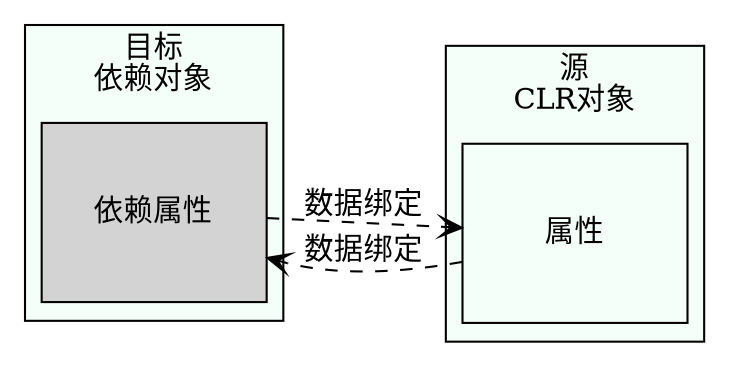

## 数据绑定
对于基于XAML的应用程序来说，数据绑定是一个极其重要的概念。数据绑定把数据从.NET对象传递给UI，或从UI传递给.NET对象。

简单对象可以绑定到UI元素、对象列表和XAML元素上。在数据绑定中，目标可以是XAML元素的任意依赖属性，CLR对象的每个属性都可以是绑定源。因为XAML元素也提供了.NET属性，所以每个XAML元素也可以用作绑定源。下图显示了绑定源和绑定目标之间的连接。绑定定义了该连接。

Binding对象支持源与目标之间的几种绑定模式。绑定可以是单向的，即从源信息指向目标，但如果用户在用户界面上修改了该信息，则原不会更新。要更新源，需要双向绑定。



<table>
  <th>绑定模式</th>
  <th>说明</th>
  <!--下一行-->
  <tr>
    <td>
      一次性   
    </td>
    <td>
      绑定从源指向目标，且仅在应用程序启动时，或数据上下文改变时绑定一次。通过这种模式可以获得数据的快照。
    </td>
  </tr>
<!--下一行-->
<tr>
  <td>单向</td>
  <td>
    绑定从源指向目标。这对于只读属性很有用，因为他不能从用户界面修改数据。要更新用户界面，源必须实现INotifyPropertyChanged接口。
  </td>
</tr>
<!--下一行-->
<tr>
  <td>双向</td>
  <td>
    用户可以从UI中修改数据。绑定是双向的——从源指向目标，从目标指向源。源对象需要实现读\写属性，才能把改动的内容从UI更新到源对象上。
  </td>
</tr>
<!--下一行-->
<tr>
  <td>指向源的单向</td>
  <td>
    采用这种模式，如果目标属性改变，源对象也会更新。这种绑定不能用于UWP，但可以用于WPF和Xammarin。
  </td>
</tr>
</table>

==注意：UWP支持两种绑定类型：使用Binding标记扩展的传统绑定，以及使用x:Bind标记扩展的新编译绑定。请注意，绑定模式的默认值在这些绑定类型之间存在差异，因此最好总是指定绑定模式。本节关注编译绑定==

除了绑定模式之外，数据绑定还涉及许多方面。本节详细介绍与简单的.NET对象和列表的绑定。通过更改通知，可以使用绑定对象中的更改更新UI。本节也将论述如何动态地选择数据模板。

下面从DataBindingSamples示例应用程序开始。该应用程序显示图书列表，并允许用户选择一本书，来查看图书细节。


### 用INotifyPropertyChanged更改通知
首先创建模型。为了在属性值变化时把更改信息传递给用户界面，必须实现INotifyPropertyChanged接口。为了重用此实现代码，创建实现此接口的BindableBase类。
该接口定义了PropertyChanged事件处理程序，该事件在OnPropertyChanged方法中触发。方法set用于更改属性值，并触发PropertyChanged事件。

如果要设置的值与当前值没有不同，则不触发事件，且方法仅返回false。只有使用不同的值是，属性才设置为新值，并触发PropertyChanged事件。这个方法在C#编译器就会通过这个参数传递属性名，所以不需要在代码中添加硬编码字符串。
```csharp
using System;
using System.Collections.Generic;
using System.ComponentModel;
using System.Linq;
using System.Runtime.CompilerServices;
using System.Text;
using System.Threading.Tasks;

namespace WinTest.Models
{
    public class BindableBase : INotifyPropertyChanged
    {
        public event PropertyChangedEventHandler PropertyChanged;

        public virtual bool Set<T>(ref T item, T value, [CallerMemberName] string propertyName = null)
        {
            if (EqualityComparer<T>.Default.Equals(item, value)) return false;
            item = value;
            OnPropertyChanged(propertyName);
            return true;
        }

        protected virtual void OnPropertyChanged(string propertyName) =>
            PropertyChanged?.Invoke(this, new PropertyChangedEventArgs(propertyName));
    }
}


//---------------------------------------------------------------
//Book类派生自基类BindableBase，并实现了属性BookId、Title、Publisher和Authors。
//BookId属性时只读的；
//Title和Publisher使用来自基类的变更通知实现；
//Author是一个只读属性，返回作者列表。
using System;
using System.Collections.Generic;
using System.Linq;
using System.Text;
using System.Threading.Tasks;

namespace WinTest.Models
{
    public class Book:BindableBase
    {

        public int BookId { get; }
        
        
        private string _title;
        public string Title
        {
            get => _title;
            set => Set(ref _title, value);
        }

        private string _publisher;
        public string Publisher
        {
            get => _publisher;
            set => Set(ref _publisher, value);
        }

        public IEnumerable<string> Authors { get; set; }

        public override string ToString() => Title;

        public Book(int id,string title,string publisher,params string[] authors)
        {
            BookId = id;
            Title = title;
            Publisher = publisher;
            Authors = authors;
        }
    }
}
```


### 创建图书列表
GetSampleBooks方法返回应使用Book类的构造函数显示的图书列表。
```csharp
using System;
using System.Collections.Generic;
using System.Linq;
using System.Text;
using System.Threading.Tasks;
using WinTest.Models;

namespace WinTest.Services
{
    public class SampleBooksService
    {
        public IEnumerable<Book> GetSampleBooks() =>
            new List<Book>()
            {
                new Book(1,"乌合之众","今日出版社","斯密斯.赵峰"),
                new Book(1,"九霄云外的惊变","无知出版社","尼古拉斯.雅淇"),
                new Book(1,"大众点评","机械工业出版社","亚当斯"),
                new Book(1,"仓求咧积分","清华出版社","索罗斯"),
                new Book(1,"苍穹之下宗盛","无敌份额出版社","麦克.贾克斯")
            };
    }
}


//现在BooksService提供了RefreshBooks、GetBook、AddBook方法以及属性Books。属性Books返回一个ObservableCollection<Book>对象。
//ObservableCollection是一个泛型类，通过实现接口INotifyCollectionChanged来提供更改通知。

using System;
using System.Collections.Generic;
using System.Collections.ObjectModel;
using System.Linq;
using System.Text;
using System.Threading.Tasks;
using WinTest.Models;

namespace WinTest.Services
{
    public class BooksService
    {
        private ObservableCollection<Book> _books = new ObservableCollection<Book>();

        public void RefreshBooks()
        {
            _books.Clear();
            var sampleBooksService = new SampleBooksService();
            var books = sampleBooksService.GetSampleBooks();
            foreach(var book in books)
            {
                _books.Add(book);
            }
        }

        public Book GetBook(int bookId) =>
            _books.Where(b => b.BookId == bookId).SingleOrDefault();

        public void AddBook(Book book) => _books.Add(book);

        public IEnumerable<Book> Books => _books;
    }
}
```


### 列表绑定
现在可以显示图书列表了。可以使用任何ItemsSource派生控件指定ItemsSource属性，绑定到列表上。下面的代码片段使用ListView控件将ItemsSource绑定到Books属性上。使用标记扩展x:Bind时，指定的第一个名称是绑定的源，Mode参数确定了绑定模式。对于OneWay，当消息源发生变化时，UWP利用变更通知来更新用户界面：
```csharp
<ListView ItemsSource="x:Bind Books,Mode=OneWay" Grid.Row="1">
```
代码隐藏文件中，指定Books属性以引用BooksService的Books属性。
```csharp
using System;
using System.Collections.Generic;
using System.Globalization;
using System.Linq;
using Windows.UI;
using Windows.UI.Popups;
using Windows.UI.Xaml;
using Windows.UI.Xaml.Controls;
using WinTest.Services;
using WinTest.Models;


// https://go.microsoft.com/fwlink/?LinkId=402352&clcid=0x804 上介绍了“空白页”项模板

namespace WinTest
{
    /// <summary>
    /// 可用于自身或导航至 Frame 内部的空白页。
    /// </summary>
    public sealed partial class MainPage : Page
    {
        public MainPage()
        {
            this.InitializeComponent();
        }

        private BooksService _booksService = new BooksService();

        public IEnumerable<Book> Books => _booksService.Books;
    }
}
```

### 把事件绑定到方法
如果没有在BooksService中调用RefreshBooks方法，列表将为空。
使用XAML文件，会创建一个CommandBar，其中列出两个AppBarButton控件。
通过AppBarButton控件，Click事件再次绑定到OnRefreshBooks和OnRefresh方法上。
```csharp
//--MainPage.xaml
    <Grid Background="{ThemeResource ApplicationPageBackgroundThemeBrush}">
        <Grid.RowDefinitions>
            <RowDefinition Height="auto"/>
            <RowDefinition Height="*"/>
        </Grid.RowDefinitions>
        <Grid.ColumnDefinitions>
            <ColumnDefinition Width="auto"/>
            <ColumnDefinition Width="*"/>
        </Grid.ColumnDefinitions>
        <CommandBar Grid.Row="0" Grid.Column="0" Grid.ColumnSpan="2">
            <AppBarButton Icon="Refresh" Label="Refresh" Click="{x:Bind OnRefreshBooks}"/>
            <AppBarButton Icon="Add" Label="Add Book" Click="{x:Bind OnAddBook}"/>
        </CommandBar>
        <ListView ItemsSource="x:Bind Books,Mode=OneWay" Grid.Row="1">
    </Grid>


//------------------------------------------------------------------
// MainPage.xaml.cs
using System;
using System.Collections.Generic;
using System.Globalization;
using System.Linq;
using Windows.UI;
using Windows.UI.Popups;
using Windows.UI.Xaml;
using Windows.UI.Xaml.Controls;
using WinTest.Services;
using WinTest.Models;


// https://go.microsoft.com/fwlink/?LinkId=402352&clcid=0x804 上介绍了“空白页”项模板

namespace WinTest
{
    /// <summary>
    /// 可用于自身或导航至 Frame 内部的空白页。
    /// </summary>
    public sealed partial class MainPage : Page
    {
        public MainPage()
        {
            this.InitializeComponent();
        }

        private BooksService _booksService = new BooksService();

        public IEnumerable<Book> Books => _booksService.Books;

        public void OnRefreshBooks() => _booksService.RefreshBooks();

//如果方法没有参数或具有事件的委托类型指定的参数，则可以将时间绑定到方法。在以下代码中，OnRefreshBooks和OnAddBook方法声明为void，没有参数。
       
        public void OnAddBook() =>
            _booksService.AddBook(new Book(GetNextBookId(),$"不知道{GetNextBookId()+3}","工业出版社"));

        public int GetNextBookId()=>Books.Select(b=>b.BookId).Max()+1;
    }
}
```
==注意：绑定到方法上只能使用x:Bind标记扩展，不能使用传统的Binding标记扩展==

正在运行的应用程序带有两个AppBar按钮，单击Refresh按钮加载图书，并显示图书标题，因为Book类的ToString方法返回标题。单击Add按钮会创建一个新的Book对象，该对象会出现在列表中，因为列表的类型是ObservableCollection。
ObservableCollection通过接口INotifyCollectionChanged实现了更改通知。


<br>
<hr>

### 使用数据模板和数据模板选择器
为了创建不同的项外观，可以创建一个DataTemplate。可以使用x:key特性指定的键引用DataTemplate。使用x:DateType特性时，可以在数据模板中使用已经编译绑定。已编译绑定需要在编译时绑定到的类型。要绑定到Title属性，类型由Book类定义。
```csharp
<Page.Resources>
  <DataTemplate x:DataType="models:Book" x:Key="WroxTemplate">
    <Border Background="Red" Margin="4" Padding="4" BorderThickness="2" BorderBrush="DarkRed">
      <TextBlock Text=>
    </Border>
  </DataTemplate>
</Page.Resources>
```


