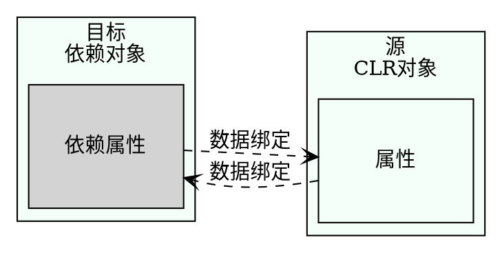

## 数据绑定
对于基于XAML的应用程序来说，数据绑定是一个极其重要的概念。数据绑定把数据从.NET对象传递给UI，或从UI传递给.NET对象。

简单对象可以绑定到UI元素、对象列表和XAML元素上。在数据绑定中，目标可以是XAML元素的任意依赖属性，CLR对象的每个属性都可以是绑定源。因为XAML元素也提供了.NET属性，所以每个XAML元素也可以用作绑定源。下图显示了绑定源和绑定目标之间的连接。绑定定义了该连接。

Binding对象支持源与目标之间的几种绑定模式。绑定可以是单向的，即从源信息指向目标，但如果用户在用户界面上修改了该信息，则原不会更新。要更新源，需要双向绑定。

<table>
  <th>绑定模式</th>
  <th>说明</th>
  <!--下一行-->
  <tr>
    <td>
      一次性   
    </td>
    <td>
      绑定从源指向目标，且仅在应用程序启动时，或数据上下文改变时绑定一次。通过这种模式可以获得数据的快照。
    </td>
  </tr>
<!--下一行-->
<tr>
  <td>单向</td>
  <td>
    绑定从源指向目标。这对于只读属性很有用，因为他不能从用户界面修改数据。要更新用户界面，源必须实现INotifyPropertyChanged接口。
  </td>
</tr>
<!--下一行-->
<tr>
  <td>双向</td>
  <td>
    用户可以从UI中修改数据。绑定是双向的——从源指向目标，从目标指向源。源对象需要实现读\写属性，才能把改动的内容从UI更新到源对象上。
  </td>
</tr>
<!--下一行-->
<tr>
  <td>指向源的单向</td>
  <td>
    采用这种模式，如果目标属性改变，源对象也会更新。这种绑定不能用于UWP，但可以用于WPF和Xammarin。
  </td>
</tr>
</table>

==注意：UWP支持两种绑定类型：使用Binding标记扩展的传统绑定，以及使用x:Bind标记扩展的新编译绑定。请注意，绑定模式的默认值在这些绑定类型之间存在差异，因此最好总是指定绑定模式。本节关注编译绑定==

除了绑定模式之外，数据绑定还涉及许多方面。本节详细介绍与简单的.NET对象和列表的绑定。通过更改通知，可以使用绑定对象中的更改更新UI。本节也将论述如何动态地选择数据模板。

下面从DataBindingSamples示例应用程序开始。该应用程序显示图书列表，并允许用户选择一本书，来查看图书细节。