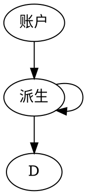
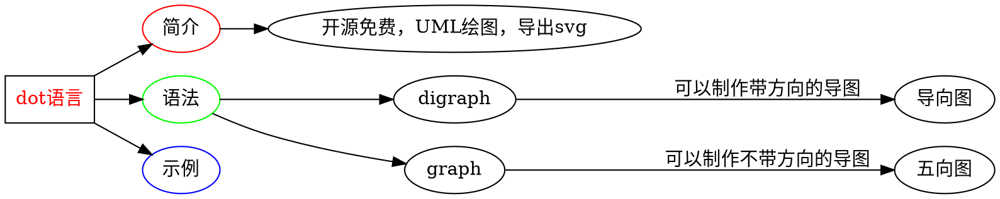

# Lottery Modeling

## 用例
```sequence {theme="simple"}
Andrew->China: Says Hello
Note right of China: China thinks\nabout it
China-->Andrew: How are you?
Andrew->>China: I am good thanks!
```

```sequence{theme="simple"}
用户->彩票店:购买彩票
note left of 彩票店:fe
彩票店--> 彩票中心:下单
```





