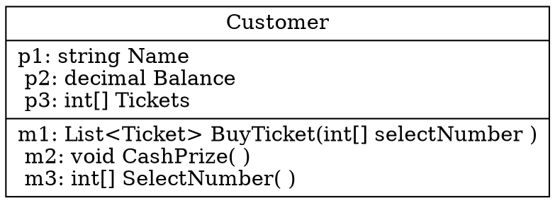
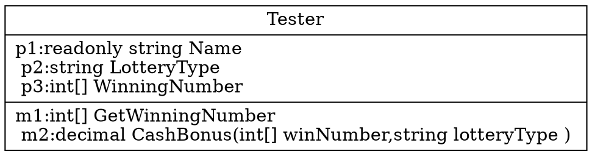
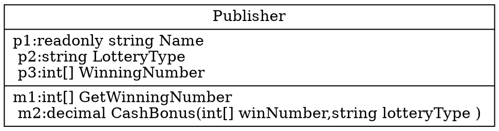
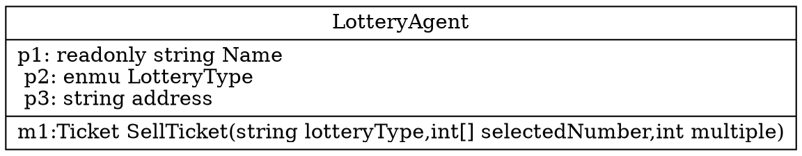
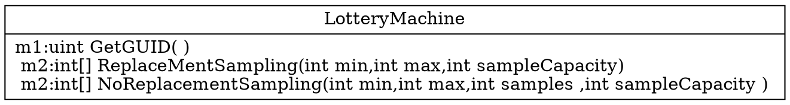

```dot 
digraph Customer{
    node [shape=record]
    
    customer [label="{Customer | 
            p1: string Name  \l
            p2: decimal Balance \l
            p3: int[] Tickets \l
            |
            m1: List\<Ticket\>  BuyTicket(int[] selectNumber )\l
            m2: void CashPrize( ) \l  
            m3: int[] SelectNumber( )  \l }"]
}
```

```dot
digraph Tester{
    node [shape=record]
    tester  [label="{Tester    |
            p1:readonly string Name \l
            p2:string LotteryType   \l
            p3:int[] WinningNumber  \l|
            m1:int[] GetWinningNumber   \l
            m2:decimal CashBonus(int[] winNumber,string lotteryType ) \l      
            }"]
}
```

```dot
digraph Publisher{
    node [shape=record]
    publisher [label="{Publisher    |
            p1:readonly string Name \l
            p2:string LotteryType   \l
            p3:int[] WinningNumber  \l|
            m1:int[] GetWinningNumber   \l
            m2:decimal CashBonus(int[] winNumber,string lotteryType ) \l      
            }"]
}
```

```dot
digraph LotteryAgent{
    node [shape=record]
    lotteryAgent [label="{LotteryAgent    |
            p1: readonly string Name \l
            p2: enmu LotteryType   \l
            p3: string address      \l

            |
            m1:Ticket SellTicket(string lotteryType,int[] selectedNumber,int multiple)
            }"]
}
```

```dot
digraph LotteryMachine{
    node [shape=record]
    lotteryMachine [label="{LotteryMachine  |
            m1:uint GetGUID( )  \l
            m2:int[] ReplaceMentSampling(int min,int max,int sampleCapacity)  \l
            m2:int[] NoReplacementSampling(int min,int max,int samples ,int sampleCapacity ) \l
            }"]

}
```