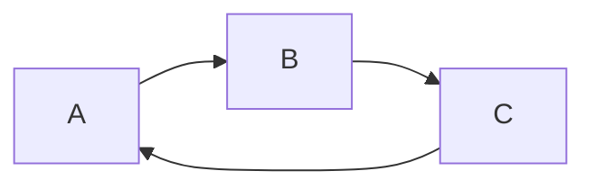
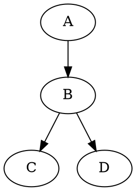

Markdown是一种轻量级标记语言，它允许人们使用易读易写的纯文本编写文档。
Markdown编写的文档可以到处HTML、Word、图像、PDF、Epub等多种格式的文档。
Markdown编写的文档后缀为.md，.markdown。


Markdown 应用
1、Markdown能被用来撰写电子书，如：gitbook。
2、当前许多网站都广泛使用Markdown来撰写帮助文档或用于论坛上发表消息。例如：github、简书、reddit、等。

编辑器
1、本教程使用Typora编辑器来讲解Markdown的语法，typora支持MacOs、Windows、Linux平台，且包含多种主题，编辑后直接渲染出效果。
2、支持到处HTML、PDF、Word、图片等多种类型文件。


## Markdown标题
1、使用=和-标记一级和二级标题

例如：
我展示的是一级标题
=================

我展示的是二级标题
-----------------

## 2、使用#标记
使用#号可以表示1-6级标题，一级标题#号，以此类推。

# 一级标题
## 二级标题
### 三级标题

#### 四级标题
##### 五级标题

###### 六级标题


​      

Markdown段落

markdown段落没有特殊的格式，直接编写文字就可以，段落的换行就是使用两个以上的空格加上回车。

当然也可以在段落后面使用空行表示重新开始一个段落

   

## 字体
markdown可以使用以下几种字体：
*斜体文本*
_科技文本_
**粗体文本**
__粗体文本__
***粗斜体文本***
___粗斜体文本___


## 分隔线
你可以在一行中用三个以上的星号、减号、底线来建立一个分隔线，行内不能有其他东西。你也可以在星号或是减号中间插入空格。下面每种写法都可以建立分隔线：

***

* * *

******

---

- - -
---------

## 删除线
如果段落上的文字要添加删除线，只要在文字的两段加上两个波浪线~~即可，示例如下：
今天是个好日子
~~今天不是个好日子~~


## 下划线
下划线可以通过HTML的u 标签来实现

<u>带下划线文本</u>


## 脚注
脚注是对文本的补充说明。
markdown 脚注的格式如下

创建脚注格式类似这样 [^Runoob]。
这个是脚注2[^避风塘]
[^Runoob]:学的不仅仅是技术，更是梦想！！
[^避风塘]:在浙江省

## Markdown列表

markdown支持有序列表和无序列表。
无序列表使用星号（*）、加号（+）或是减号（-）作为列表标记，这些标记后面要添加一个空格，然后在填写内容：

* 第一项
* 第二项
* 第三项

+ 第六项
+ 第七项

- 第八项
  
- 第九项


有序号列表使用数字并加上.号来表示，如:
1.第一项
2.第二项
4.第四项


## 列表嵌套
列表嵌套只需要在字列表中的选项面前添加四个空格即可

1.第一项：
 - 第一项嵌套的第一个元素
 - 第一项嵌套的第二个元素

2.第二项:
 - 第二项嵌套的第一个元素
 - 第二项嵌套的第二个元素

---

1.第一项：
  -  第一项嵌套的第一个元素
  -  第一项嵌套的第二个元素

2.第二项:
  -  第二项嵌套的第一个元素
  -  第二项嵌套的第二个元素

## Markdown 区块
Markdown区块引用是在段落开头使用> 符号，然后后面紧紧跟一个空格：

> 区块引用
> 菜鸟教程
> 学习的不仅仅知识，
更是梦想！

另外区块是可以嵌套的，一个> 符号是最外层，两个>>符号是第一层嵌套，以此类推：
> 最外层
> > 第一层嵌套
> >  我的家庭
> >
> > > 第三层嵌套


## 区块中使用列表：
区块中使用列表实例如下：

> 区块中使用列表
> 1.第一项
> 2.第二项
>
> + 第一项
> + 第二项
> + 第三项


##列表中使用区块
如果要在列表项目内让进区块，那么就需要在> 前面添加四个空格的缩进。
区块中使用列表实例如下：
* 第一项
    > 菜鸟教程
    > 学的不仅仅是技术，
    更是梦想
* 第二项


##Markdown代码
如果是段落上的一个函数或片段的代码可以用反引号（'）把它抱起来，例如：

`printf()`窗口

## `代码区块`

代码区块使用4个空格或者一个制表符（tab键）。

示例如下：


```csharp
public class User{
  public User(){
  Console.writeLine();
  }
}
```

    <?php
    echo 'RUNOOB';
    function tewst(){
      echo 'test'
    }
    >

```java
public class Employ
  {
    public Employ()
    {
      System.out.println("jifei");
    }
  }
```

## Markdown 链接
链接使用方法如下：
[链接名称](链接地址)
或者
<链接地址>
例如：
[百度一下你就知道](www.baidu.com)

<https://www.zhcw.com>


##高级链接
我们可以通过变量来设置一个链接，变量赋值在文档末尾进行:
这个连接用 1 作为网址变量 [百度][1]
这个链接用 runoob 作为网址变量 [中彩网][runoob]
然后在文档的结尾为变量赋值(网址)，以下必须有一个空行

[1]:http://www.www.baidu.com/
[runoob]:htp://www.zhcw.com/


## Markdown图片
Markdown图片语法格式如下：


1、开头一个感叹号!
2、接着一个方括号，里面放上图片的替代文字
3、接着一个普通括号，里面放上图片的网址，最后还可以一弄宝珠并加上选择性的"title"属性文字。

当然，你也可以向网址那样对图片网址使用变量:
这个链接用1作为网址变量[git 分支合并][1]

[1]: d:/project/Learn/0.png


Markdown 还没有办法指定图片的高度与宽度，如果你需要的话，可以使用\标签。


## Markdown表格

Markdown制作表格使用"|"来分隔不同的单元格，使用"-"来分隔表头和其他行。
语法如下：

|表头|表头|
|----|----|
|单元格|单元格|
|单元格|单元格|

我们可以设置表格的对其方式:
1、 -:  设置内容和标题栏居右对齐。
2、 :-  设置内容和标题栏居左对齐。
3、 :-: 设置内容和标题栏居中对齐。

实例如下:

|名称|合同编号|借款本金|
|:----|:----:|----:|
|大理同人资产运营有限公司|1003040971|473,125.48|
|大理经开投集团公司|1004010110|5,545,510.19|


|name|age|gender|money|
|:--------:|:--:|:-------------:|--------:|
|rhio|26|roboteae|￥23651.00|
|haroo|.3|fe5a6|￥485.00|
|jilief|？？|f5e9w5|$129601548.16|

Markdown支持html语法，所以我们可以使用excel或html代码生成我们需要的表格，放入markdown中。

<table border=0 cellpadding=0 cellspacing=0 width=750 style='border-collapse:
 collapse;table-layout:fixed;width:563pt'>
 <col width=254 style='mso-width-source:userset;mso-width-alt:8128;width:191pt'>
 <col width=124 span=4 style='mso-width-source:userset;mso-width-alt:3968;
 width:93pt'>
 <tr height=31 style='height:23.25pt'>
  <td colspan=5 height=31 class=xl122 width=750 style='height:23.25pt;
  width:563pt'>现金流量表</td>
 </tr>
 <tr height=19 style='height:14.25pt'>
  <td height=19 class=xl72 style='height:14.25pt'>项目名称</td>
  <td class=xl72 style='border-left:none'>2016年</td>
  <td class=xl72 style='border-left:none'>2017年</td>
  <td class=xl72 style='border-left:none'>2018年</td>
  <td class=xl72 style='border-left:none'>2019年6月30</td>
 </tr>
 <tr height=19 style='height:14.25pt'>
  <td height=19 class=xl123 style='height:14.25pt;border-top:none'>经营活动现金流入小计</td>
  <td class=xl124 align=right style='border-top:none;border-left:none'>2,091,395,992.77</td>
  <td class=xl124 align=right style='border-top:none;border-left:none'>3,450,149,786.07</td>
  <td class=xl124 align=right style='border-top:none;border-left:none'>2,872,361,932.98</td>
  <td class=xl124 align=right style='border-top:none;border-left:none'>1,027,768,693.77</td>
 </tr>
 <tr height=19 style='height:14.25pt'>
  <td height=19 class=xl72 style='height:14.25pt;border-top:none'>经营活动现金流出小计</td>
  <td class=xl66 align=right style='border-top:none;border-left:none'>1,517,016,777.25</td>
  <td class=xl66 align=right style='border-top:none;border-left:none'>3,294,224,428.59</td>
  <td class=xl66 align=right style='border-top:none;border-left:none'>2,493,690,247.87</td>
  <td class=xl66 align=right style='border-top:none;border-left:none'>844,845,906.01</td>
 </tr>
 <tr height=19 style='height:14.25pt'>
  <td height=19 class=xl123 style='height:14.25pt;border-top:none'>一、经营活动产生的现金流量净额</td>
  <td class=xl124 align=right style='border-top:none;border-left:none'>574,379,215.52</td>
  <td class=xl124 align=right style='border-top:none;border-left:none'>155,925,357.48</td>
  <td class=xl124 align=right style='border-top:none;border-left:none'>378,671,685.11</td>
  <td class=xl124 align=right style='border-top:none;border-left:none'>182,922,787.76</td>
 </tr>
 <tr height=19 style='height:14.25pt'>
  <td height=19 class=xl72 style='height:14.25pt;border-top:none'>投资活动现金流入小计</td>
  <td class=xl66 align=right style='border-top:none;border-left:none'>9,145,590.48</td>
  <td class=xl66 align=right style='border-top:none;border-left:none'>8,529,838.96</td>
  <td class=xl66 align=right style='border-top:none;border-left:none'>1,392,983.32</td>
  <td class=xl66 align=right style='border-top:none;border-left:none'>11,121.76</td>
 </tr>
 <tr height=19 style='height:14.25pt'>
  <td height=19 class=xl123 style='height:14.25pt;border-top:none'>投资活动现金流出小计</td>
  <td class=xl124 align=right style='border-top:none;border-left:none'>810,013,065.61</td>
  <td class=xl124 align=right style='border-top:none;border-left:none'>445,408,134.84</td>
  <td class=xl124 align=right style='border-top:none;border-left:none'>171,261,310.53</td>
  <td class=xl124 align=right style='border-top:none;border-left:none'>34,965,758.30</td>
 </tr>
 <tr height=19 style='height:14.25pt'>
  <td height=19 class=xl72 style='height:14.25pt;border-top:none'>二、投资活动产生的现金流量净额</td>
  <td class=xl66 align=right style='border-top:none;border-left:none'><font
  color="#FF0000" style='mso-ignore:color'>-800,867,475.13</font></td>
  <td class=xl66 align=right style='border-top:none;border-left:none'><font
  color="#FF0000" style='mso-ignore:color'>-436,878,295.88</font></td>
  <td class=xl66 align=right style='border-top:none;border-left:none'><font
  color="#FF0000" style='mso-ignore:color'>-169,868,327.21</font></td>
  <td class=xl66 align=right style='border-top:none;border-left:none'><font
  color="#FF0000" style='mso-ignore:color'>-34,954,636.54</font></td>
 </tr>
 <tr height=19 style='height:14.25pt'>
  <td height=19 class=xl123 style='height:14.25pt;border-top:none'>筹资活动现金流入小计</td>
  <td class=xl124 align=right style='border-top:none;border-left:none'>3,641,809,800.00</td>
  <td class=xl124 align=right style='border-top:none;border-left:none'>2,756,445,927.44</td>
  <td class=xl124 align=right style='border-top:none;border-left:none'>1,873,226,609.53</td>
  <td class=xl124 align=right style='border-top:none;border-left:none'>440,195,083.21</td>
 </tr>
 <tr height=19 style='height:14.25pt'>
  <td height=19 class=xl72 style='height:14.25pt;border-top:none'>筹资活动现金流出小计</td>
  <td class=xl66 align=right style='border-top:none;border-left:none'>3,416,145,844.62</td>
  <td class=xl66 align=right style='border-top:none;border-left:none'>2,510,342,537.45</td>
  <td class=xl66 align=right style='border-top:none;border-left:none'>2,101,889,874.77</td>
  <td class=xl66 align=right style='border-top:none;border-left:none'>721,670,777.66</td>
 </tr>
 <tr height=19 style='height:14.25pt'>
  <td height=19 class=xl123 style='height:14.25pt;border-top:none'>三、筹资活动产生的现金流量净额</td>
  <td class=xl124 align=right style='border-top:none;border-left:none'>225,663,955.38</td>
  <td class=xl124 align=right style='border-top:none;border-left:none'>246,103,389.99</td>
  <td class=xl124 align=right style='border-top:none;border-left:none'><font
  color="#FF0000" style='mso-ignore:color'>-228,663,265.24</font></td>
  <td class=xl124 align=right style='border-top:none;border-left:none'><font
  color="#FF0000" style='mso-ignore:color'>-281,475,694.45</font></td>
 </tr>
 <tr height=19 style='height:14.25pt'>
  <td height=19 class=xl72 style='height:14.25pt;border-top:none'>四、现金净增加额</td>
  <td class=xl66 align=right style='border-top:none;border-left:none'><font
  color="#FF0000" style='mso-ignore:color'>-824,304.23</font></td>
  <td class=xl66 align=right style='border-top:none;border-left:none'><font
  color="#FF0000" style='mso-ignore:color'>-34,849,548.41</font></td>
  <td class=xl66 align=right style='border-top:none;border-left:none'><font
  color="#FF0000" style='mso-ignore:color'>-19,859,907.34</font></td>
  <td class=xl66 align=right style='border-top:none;border-left:none'><font
  color="#FF0000" style='mso-ignore:color'>-133,507,543.23</font></td>
 </tr>
 <tr height=19 style='height:14.25pt'>
  <td height=19 class=xl123 style='height:14.25pt;border-top:none'><span
  style='mso-spacerun:yes'>&nbsp;&nbsp;&nbsp;&nbsp;&nbsp;&nbsp; </span>加：期初现金金额</td>
  <td class=xl124 align=right style='border-top:none;border-left:none'>0.00</td>
  <td class=xl124 align=right style='border-top:none;border-left:none'>0.00</td>
  <td class=xl124 align=right style='border-top:none;border-left:none'>0.00</td>
  <td class=xl124 align=right style='border-top:none;border-left:none'>0.00</td>
 </tr>
 <tr height=19 style='height:14.25pt'>
  <td height=19 class=xl77 style='height:14.25pt;border-top:none'>五、期末现金余额</td>
  <td class=xl125 align=right style='border-top:none;border-left:none'>191,979,178.54</td>
  <td class=xl125 align=right style='border-top:none;border-left:none'>157,129,630.13</td>
  <td class=xl125 align=right style='border-top:none;border-left:none'>137,269,722.79</td>
  <td class=xl125 align=right style='border-top:none;border-left:none'>3,762,179.56</td>
 </tr>
 <![if supportMisalignedColumns]>
 <tr height=0 style='display:none'>
  <td width=254 style='width:191pt'></td>
  <td width=124 style='width:93pt'></td>
  <td width=124 style='width:93pt'></td>
  <td width=124 style='width:93pt'></td>
  <td width=124 style='width:93pt'></td>
 </tr>
 <![endif]>
</table>


### 表格单元格合并.

|aa|bb|cc|
|--|--|--|
|1| |2|
|3|>|4|
|5|6||
|^|7|8|


<br>
<br>
## Markdown 高级技巧
### 支持的HTML元素
不在Markdown涵盖范围之内的标签，都可以直接在文档里面使用HTML撰写。
目前支持的HTML元素有:\<kbd>\<b>\<i>\<em>\<sup>\<br>等，如:

使用<kbd>Ctrl</kbd>+<kbd>Alt</kbd>+<kbd>Del</kbd>重启电脑


### 转义
Markdown使用了很多特殊符号来表示特定的意义，如果需要显示特定的符号泽需要使用转义字符，Markdown使用反斜杠转义特殊字符:

**文本加粗**
\*\*文本加粗\*\*

Markdown支持以下这些符号前面加上反斜杠来帮助插入普通的符号:

|符号|说明|
|:----:|:----:|
|\\|反斜线|
|\-|反引号|
|\*|星号|
|\_|下划线|
|\{ }|花括号|
|\[ ]|方括号|
|\( )|小括号|
|\#|井字符|
|\+|加号|
|\-|减号|
|\.|英文句点|
|\!|感叹号|

<br>
<hr>

# 数学基本语法

## 公式
当你需要在编辑器中插入数学公式时，可以使用两个美元符号\$$ 包裹TeX或LaTeX格式的数学公式实现。提交后，问答和文章会根据需要加载Mathjax对数学公式进行渲染。如:

$$
 \mathbf{v}_1 \times \mathbf{v}_2 = \begin{vmarix}
 \mathbf{i} & \mathbf{j} & \mathbf{k} \\
 \frac{\partial X}{\partial u} & \frac{\partial Y}{\partial u} & 0 \\
 \frac{\partial X}{\partial v} & \frac{\partial Y}{\partial v} & 0 \\
 \end{vmatrix}
 ${$tep1}{\style{visibility:hidden}{(x+1)(x+1)}}
$$

$$
\sum_{i=0}^N\int_{a}^{b}g(t,i)\text{d}t
$$


## 呈现位置
  -  正文inline中的LaTeX公式用\$...\$定义
  -  语句为$\sum_{i=0}^N\int_{a}^{b}g(t,i)\text{d}t$
  -  单独显示的LaTex公式用\$\$...$$显示。


## 希腊字母
|显示|命令|显示|命令|
|:-:|:-:|:-:|:-:|
|$\alpha$|\alpha|$\beta$|\beta|
|$\gamma$|\gamma|$\delta$|\delta|
|$\epsilon$|\epsilon|$\zeta$|\zeta|
|$\eta$|\eta|$\theta$|\theta|
|$\iota$|\iota|$\kappa$|\kappa|
|$\lambda$|\lambda|$\mu$|\mu|
|$\nu$|\nu|$\xi$|\xi|
|$\pi$|\pi|$\rho$|\rho|
|$\sigma$|\sigma|$\tau$|\tau|
|$\upsilon$|\upsilon|$\phi$|\phi|
|$\chi$|\chi|$\psi$|\psi|
|$\omega$|\omega|$$||

  -  若需要大写希腊字母，将命令首字母大写即可。


## 字母修饰
### 上下标
  -  上标: ^
  -  下标: _
例如: `C_n^2` 呈现为 $C_n^2$

### 矢量
\vec a 呈现为 $\vec a$
\overrightarrow{xy} 呈现为 $\overrightarrow{xy}$

### 字体
  *  Typewriter: \mathtt{A} 呈现为 $\mathtt{A}$
  *  Blackboard Bold: \mathbb{A} 呈现为 $\mathbb{A}$
  *  Sans Serif: \mathsf{A} 呈现为 $\mathsf{A}$

### 分组
  -  使用{}将具有相同等级的内容扩入其中，成组处理
  -  例如: 10^{10} 呈现为 $10^{10}$，而10^10呈现为 $10^10$

### 括号
  -  小括号:（） 呈现为$()$
  -  中括号:[] 呈现为$[]$
  -  尖括号:\langle,\rangle 呈现为$\langle$   $\rangle$
  -  使用\left(或\right)使得符号大小写于临近的公式相适应；该语句使用于所有括号类型
     -  (\frac{x}{y}) 呈现为 $(\frac{x}{y})$
     -  而\left(\frac{x}{y}\right) 呈现为 $\left(\frac{x}{y}\right)$

### 求和、极限与积分
- 求和: \sum
  - 例如: \sum_{i=1}^n{a_i} 呈现为 $\sum_{i=1}^n{a_i}$

- 极限: \lim_{x\to 0} 呈现为: $\lim_{x\to 0}$
- 积分: \int
  - 例如: \int_0^\infty{fxdx} 呈现为 $\int_0^\infty{fxdx}$

### 分式与根式
- 分式(fractions): \frac{公式1}{公式2} 呈现为 $\frac{x-y}{x+y}$
- 根式: \sqrt[x]{y} 呈现为 $\sqrt[x]{y}$ 

2020年6月29日 https://www.jianshu.com/p/a0aa94ef8ab2/

### 特殊函数
 - \函数名
  - 例如: \sin x ,\ln x ,\max(A,B,C) 呈现为$\sin x$ ，$ln x$，$max(A,B,C)$


### 特殊的符号
|符号|命令|
|:-:|:-:|
|$\infty$ |\infty|
|$\cup$ |\cup|
|$\cap$ |\cap|
|$\subset$ |\subset|
|$\subseteq$ |\subseteq|
|$\supset$ |\supset|
|$\in$ |\in|
|$\notin$ |\notin|
|$\varnothing$ |\varnothing|
|$\forall$ |\forall|
|$\exists$ |\exists|
|$\lnot$ |\lnot|
|$\nabla$ |\nabla|
|$\partial$ |\partial|

<br>


### 空格
- LaTeX语法本身会忽略空格的存在
- 小空格: a\b 呈现为 $a\ b$
- 4格空格: a\quad b 呈现为 $a\quad b$

<br>
### 矩阵
其实标记 \begin{matrix} ,结束标记 \end{matrix}，每一行末尾标记\\\，行间元素之间以&分隔。例如:

$$
\begin{matrix}
1&0&0\\
0&1&0\\
0&0&1\\
\end{matrix}
$$


### 矩阵边框
- 在起始、结束标记处用下列词语替代matrix
- pmatrix:小括号边框
- bmatrix:中括号边框
- Bmatrix:大括号边框
- vmatrix:单竖线边框
- Vmatrix:双竖线边框


$$
\begin{pmatrix}
1&0&0\\
0&1&0\\
0&0&1\\
\end{pmatrix}
$$


$$
\begin{bmatrix}
1&0&0\\
0&1&0\\
0&0&1\\
\end{bmatrix}
$$

$$
\begin{Bmatrix}
1&0&0\\
0&1&0\\
0&0&1\\
\end{Bmatrix}
$$

$$
\begin{vmatrix}
1&0&0\\
0&1&0\\
0&0&1\\
\end{vmatrix}
$$

$$
\begin{Vmatrix}
1&0&0\\
0&1&0\\
0&0&1\\
\end{Vmatrix}
$$


### 省略元素
- 横省略号: \cdots
- 竖省略号: \vdots
- 斜省略号: \ddots

例如：
$$\begin{bmatrix}
{a_{11}}&{a_{12}}&{\cdots}&{a_{1n}}\\
{a_{21}}&{a_{22}}&{\cdots}&{a_{2n}}\\
{\vdots}&{\vdots}&{\ddots}&{\vdots}\\
{a_{m1}}&{a_{m2}}&{\cdots}&{a_{mn}}\\
\end{bmatrix}
$$


### 阵列
- 需要array环境：起始、结束出以{array}声明
- 对其方式：在{array}后以{}逐行统一声明
  - 左对齐：l ，居中对其：c ，右对齐：r 。
  - 竖直线：在声明对其方式时，插入|建立竖直线
- 插入水平线： \hline

例如：
$$
\begin{array}{c|lcr}
{↓}&{a}&{b}&{c}\\
\hline
{R_1}&{c}&{d}&{a}\\
{R_2}&{e}&{b}&{c}\\
\end{array}
$$


### 方程组
- 需要cases环境: 起始、结束出以{cases}声明
例如：
$$
\begin{cases}
a_1x+b_1y+c_1z=d_1\\
a_2x+b_2y+c_2z=d_2\\
a_3x+b_3y+c_3z=d_3\\
\end{cases}
$$

<br>
<hr>
# vscode 插件Markdown preview Enhanced中code chunk使用

Markdown Preview Enhanced是一款为Atom以及vs code编辑器编写的超级强大的Markdown插件。这款插件意在让你拥有飘逸的Markdown协作体验。

### 特性
- 自动编辑器及预览滑动同步
- 导入外部文件
- Code Chunk
- Pandoc
- Prince
- 电子书
- 幻灯片
- 可扩展性
- LaTeX数学
- 导出PDF、PNG、以及JPEG凭借Puppeteer
- 导出漂亮的HTML（移动端支持）
- 编译到github Flavored Markdown
- 自定义预览 CSS
- TOC生成
- 流程图、时序图以及各种其他种类的图形
- 嵌入LaTeX，渲染TikZ，Chemfig等图形
- Task List
- 图片助手
- 脚注
- Front Matter
- 以及其他

<hr>
<br>
## 为什么使用Markdown写文档
Markdown是一种语言，这种语言的设计思路是：
1.他是一种语言而不是二进制文件格式，可以纯文本读和写
2.写的时候尽可能可读性高（这里隆重对比另一种村文本写出格式语言LaTeX，虽然二者目的原理都完全不相同）。
3.在显示的时候被翻译成HTML显示，可以很清楚很好看。

Markdown是一种纯文本格式，因此特别使用用于git进行版本控制

想象一个项目有一个图文并茂的描述文件，doc格式，大小5MB。现在我们面临一个抉择——把他放到Git上还是网盘上。

1. 如果放到git上，那么对这个文档的一丁点改变都会引起一个5MB大小的二进制文件的改动，非常浪费。
2. 如果放到网盘上，那么这个文档就会丢失大量的版本信息。中国要的改动经常需要手动备份保留。非常麻烦。

但是用Markdown之后，文档就和代码一样是一行行的纯文本；图片之类的资源是外链的，不改动图片本身就不会产生提交。这就大大提高了版本控制的效率。文档可以像代码一样享受版本控制的优点了。
3. Markdown是HTML的一种简写，在显示时会`[压缩]`成HTML。可以在Markdown里面直接使用HTML块，他们最终成为HTML的一部分。
4. Markdown的格式可以由CSS描述。预览工具或者用户可以自己决定用什么CSS显示。


<br>

### 基本的Markdown语法非常简单。
- 以#开头的行表示这是一个标题，有一级标题、二级标题...
- 以`* - +`开头的行，表表示无序的列表；以数字开头的行，表示有序列表。
- 以大于号> 开头的行被认为时一段引用的文字（可以在一些论坛，或者邮寄客户端见过用法）
> 这个就是示例，以>开头的行。表示引用。
- 没有特殊符号开头的文字就是正文段落。正文段落之间必须有空行。没有空行的换行会被认为是一行。
- 在任何时候都可以用一对`*斜体*`将内部文本标为斜体。用一对`**粗体**`将内部文本标记为粗体。
- 前面四个空格的段落被认为是代码段，或者可以认为这个段落内容不会被解释成任何格式。
- 连续敲除你能想到的合适的符号来生成分割线，比如`*** --- ___`。

<br>

### MPE对Markdown语法的增强
首先是目录，对于长文档来说，目录很必要。
在MPE里最简单的插入目录的方法就是在单独的行里使用[TOC]标记。这会在当前位置立即插入一个目录。
<hr><br>
## Markdown基本要素
如果给标题欠佳id或者class，请在标题最后添加{#id .class1 .class2}

例如：
# 这个是拥有1个id的标题 {#1}

# 这个标题有两个classes {.class1 .class2}
这个是MPE扩展的特性。

### 引用
> 我们自共产主义的接班人！
> 我们是事件

### 分隔线
> \----- 连字符
> \***** 星号
> \_____ 下划线

### 行内代码
`Console.WriteLine()`

```csharp
public class A{
  public static void main(string[] args){
    Console.WriteLine("fef");
  }
}
```


### 代码块class （MPE扩展的特性）
你可以给你的代码块设置class。
例如,添加 class1 class2 到一个代码块：
```javascript {.class1 .class}
function add(x,y){
  return x+y
}
```

#### 代码行数
代码行数，只要添加line-numbers class就可以了。
例如：
```javascript {.line-numbers}
function add(x,y){
  return x+y
}
```


### 任务列表
- [x] @mentions,#refs,[links](),**formatting**,and <del>tags</del> suppor
- [ ] list syntax required (any unordered or ordered list supported)
- [ ] this is an incomplete item 

### 上标、下标（使用^^和__将上标和下标的围起来）
扩展上标 `30^th^  30^2` 显示 30^th^
扩展下标 `H~2~O`  显示 H~2~O

没有扩展的上标：
`$30^9$   $30^{tf}$   $30^{fe}$` 显示 $30^9$   $30^{tf}$   $30^{fe}$

没有扩展的下标：
`$C_1$  $C_{23}$` 显示 $C_1$   $C_{23}$


### 脚注

`Content [^文献19fe]`
`[^文献19fe]:这个是脚注`
显示：
Content [^文献19fe]
[^文献19fe]:这个是脚注


### 标记
`==marked==`  ==marked==

### CriticMarkup
CriticMarkup默认是禁用的，你可以通过插件设置来启动。
这里有5种基本语法：
- 添加{++ ++}
- 删除{-- --}
- 替换{~~  ~> ~~}
- 注释{>>  <<}
- 高亮{== ==}


## 数学
Markdown Preview Enhanced使用KaTeX或者MathJax来渲染数学表达式。

KaTeX拥有比MathJax更快的性能，但是他却少了很多MathJax拥有的特性。
默认下的分隔符：
- `$...$  或者 \(...\)`中的数学表达式将会行内显示。
- `$$...$$  或者  \[...\]  或者 ```math `中的数学表达式将会在块内显示。


<br>
<hr>
## 图像
Markdown Preview Enhanced 内部支持 `flow charts , sequence diagrams , mermaid , PlantUML , WaveDrom, GraphViz,Vega-lite, Ditaa  `图像渲染。你也可以通过使用Code Chunk来渲染， `TikZ,Python Matplotlib,plotly` 等图像。 


### Flow Charts
这一特性基于flowchart.js
- `flow ` 代码块中的内容将会被flowchart.js渲染。

示例：

```flow
st=>start: 入口:>http://www.google.com[blank]
e=>end: 出口 :> http://www.google.com
op1=>operation: My Operation
sub1=>subroutine: My Subroutine
cond=>condition: Yes or No? :> http://www.google.com
io=>inputoutput: catch something

st->op1->cond
cond(yes)->io->e
cond(no)->sub1(right)->op1
```

>代码如下：
\```flow
st=>start: Start:>http://www.google.com[blank]
e=>end:> http://www.google.com
op1=>operation: My Operation
sub1=>subroutine: My Subroutine
cond=>condition: Yes
or No?:> http://www.google.com
io=>inputoutput: catch something

st->op1->cond
cond(yes)->io->e
cond(no)->sub1(right)->op1
\```

<hr>

### Sequence Diagrams
- sequence 代码块中的内容将会被js-sequence-diagrams渲染。
- 支持两个主题 `simple （默认）` 和 `hand`

>代码如下：
\```sequence {theme="simple"}
Andrew->China: Says Hello
Note right of China: China thinks\nabout it
China-->Andrew: How are you?
Andrew->>China: I am good thanks!
\``` 

```sequence {theme="simple"}
Andrew->China: Says Hello
Note right of China: China thinks\nabout it
China-->Andrew: How are you?
Andrew->>China: I am good thanks!
```

---

>代码如下：
\```sequence {theme="hand"}
Andrew->China: Says Hello
Note right of China: China thinks\nabout it
China-->Andrew: How are you?
Andrew->>China: I am good thanks!
\```

```sequence {theme="hand"}
Andrew->China: Says Hello
Note right of China: China thinks\nabout it
China-->Andrew: How are you?
Andrew->>China: I am good thanks!
```

[2020年6月30日17:05分](https://shd101wyy.github.io/markdown-preview-enhanced/#/zh-cn/diagrams?id=flow-charts)


### Mermaid
Markdown Preview Enhanced使用mermaid来渲染流程图和时序图
- `mermaid `代码块中的内容将会渲染mermaid图像。
- 查看mermaid文档 了解更多如何创建图形。

> 代码如下：
\```mermaid
graph LR
A -->B;
B -->C;
C -->A;
\```




三个mermaid主题是支持的，并且你可以在插件设置中设置主题。
- mermaid.css
- mermaid.dark.css
- mermaid.forest.css
- 还可以通过markdown Preview Enhanced：Open Mermaid Config命令打开mermaid配置文件。


<br>

### PlantUML
使用PlantUML来创建各种图形。（java是需要被先安装好的）
- 你可以安装Graphviz（非必须）来辅助生成各种图形；
- `puml`或者`plantuml`代码块中的内容将被PlantUML渲染

>代码如下：
\```puml
A -> B
\```

>代码如下：
\```puml
@startuml
a -> b
b -> c
@enduml
\```


### WaveDrom
使用WaveDrom来渲染digital timing diagram。

> 代码如下：
\```wavedrom
{signal:
 [
    {name: 'clk',wave: 'p..Pp..p'},
    ['Master',
        ['ctrl',
          {name: 'write',wave:'01.0....'},
          {name: 'read',wave:'0...1..0'}
        ],
        {name: 'addr',wave:'x2.x4..x',data:'A1 A2'},
        {name: 'wdata',wave:'x3.x....',data: 'D1'},
    ],
    {},
    ['Slave',
      ['ctrl',
        {name:'ack',wave:'x01x0.1x'},
      ],
      {name:'rdata',wave:'x......4x',data:'Q2'},
    ]
 ]
}
\```

```wavedrom
{signal:
 [
    {name: 'clk',wave: 'p..Pp..p'},
    ['Master',
        ['ctrl',
          {name: 'write',wave:'01.0....'},
          {name: 'read',wave:'0...1..0'}
        ],
        {name: 'addr',wave:'x2.x4..x',data:'A1 A2'},
        {name: 'wdata',wave:'x3.x....',data: 'D1'},
    ],

    {},
    ['Slave',
      ['ctrl',
        {name:'ack',wave:'x01x0.1x'},
      ],
      {name:'rdata',wave:'x......4x',data:'Q2'},
    ]
 ]
}
```

<br>
```wavedrom
{signal: 
  [
    {name:'测试1',wave:'123456789'},
    {name:'测试2',wave:'p..Pp..p'}
  ]
}
```

<br>

### 使用Viz.js来渲染dot语言图形
- ` viz `或者` dot `代码块中的内容将被Viz.js渲染
- 你可以通过`{engine="..."} `来选择不同的渲染引擎。引擎` circo，dot，neato，osage，或者twopi`是被支持的。默认下，使用dot引擎。


>**代码如下：**
\```dot
digraph G{
  A->B
  B->C
  B->D
}
\```


---

>代码如下：
\```dot {engine="circo"}
digraph G{
  A->B
  B->C
  B->D
}
\```


---
<br>

### Vega和Vega-lite
Markdown Preview Enhanced 支持vega以及vega-lite的静态图像
- `vega` 代码块中的内容将被vega渲染；
- `vbega-lite` 代码块中的内容将被vega-lite渲染；
- `JSON` 以及 `YAML` 输入是支持的；

>代码如下：
\```vega-lite
{
  "$schema":
  "https://vega.github.io/schema/vega-lite/v2.json",
  "description":"A simple bar chart with embedded data.",
  "data":
  {
    "values":
    [
      {"a":"A","b":20},
      {"a":"B","b":26},
      {"a":"C","b":40},
      {"a":"D","b":44},
      {"a":"E","b":31},
      {"a":"F","b":63},
      {"a":"G","b":120},
      {"a":"H","b":140},
      {"a":"I","b":45}
    ]
  },
  "mark":"bar",
  "encoding":
  {
    "x":{"field":"a","type":"ordinal"},
    "y":{"field":"b","type":"quantitative"}
  },
  "width":500,
  "height":400
}
\```

```vega-lite
{
  "$schema":
  "https://vega.github.io/schema/vega-lite/v2.json",
  "description":"A simple bar chart with embedded data.",
  "data":
  {
    "values":
    [
      {"a":"A","b":20},
      {"a":"B","b":26},
      {"a":"C","b":40},
      {"a":"D","b":44},
      {"a":"E","b":31},
      {"a":"F","b":63},
      {"a":"G","b":120},
      {"a":"H","b":140},
      {"a":"I","b":45}
    ]
  },
  "mark":"bar",
  "encoding":
  {
    "x":{"field":"a","type":"ordinal"},
    "y":{"field":"b","type":"quantitative"}
  },
  "width":500,
  "height":400
}
```

[2020年6月30日学习](https://shd101wyy.github.io/markdown-preview-enhanced/#/zh-cn/diagrams)