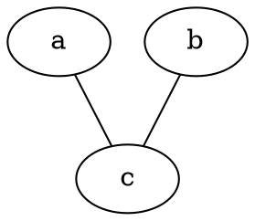
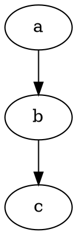
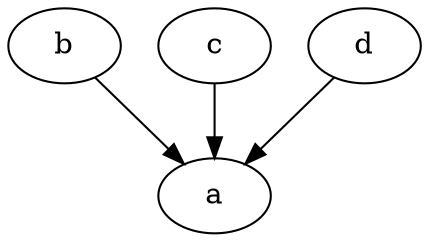
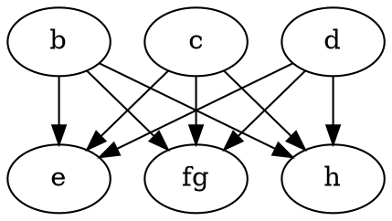
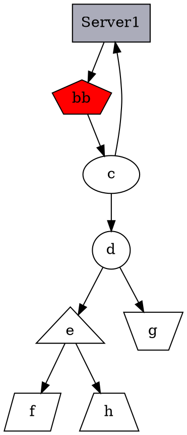
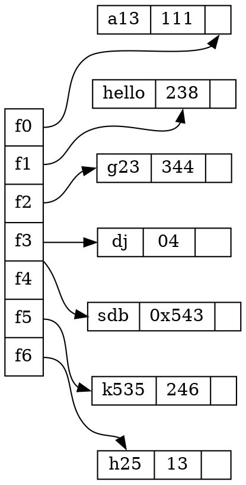

# Graphviz
Graphviz是贝尔实验室开发的一套“所向即所得”的画流程图工具。

### 优势
- 纯文本编辑
- 适合git管理
- git管理后，协作编辑就方便

## Windows平台下
- 下载安装配置环境变量
  - Install
  - 配置环境变量
  - 验证
- 基本绘图入门
  - graph
  - digraph
  - 一个复杂的例子
- 和python交互

## 下载安装、配置环境变量
### install
Windows版本[下载地址](http://www.graphviz.org/download/) 
> http://www.graphviz.org/download/

### 配置环境变量
==将graphviz安装目录下的bin文件夹添加到path环境变量中==

### 验证
进入命令提示符，输入 `dot -version` ，会显示相关版本信息。

### 建议使用 Visual Studio Code安装插件。
安装Graphviz(dot) language support for visual studio code 扩展

<hr>
<br>

## 基本概念
Graphviz分为两种类型的图
- Graph没有方向的图，元素之间只有连接，没有箭头方向
- Digraph元素之间，用带方向的箭头连接，Direction Graph

### Graph无向图
>\```dot
graph a{
a--b
b--c
}
\```



<hr>
<br>

### Digraph有向图

>\```dot
digraph g{
a->b
b->c
}
\```




### 一些基本图像
1节点形状

> https://graphviz.gitlab.io/_pages/doc/info/shapes.html


> https://graphviz.gitlab.io/_pages/doc/info/shapes.html

<hr>
<br>

箭头形状

> https://graphviz.gitlab.io/_pages/doc/info/arrows.html

### 基本命令
生成图片
```
dot test.dot -T png -o D:/project/Learn/test.png
```

### 中文乱码
通常是缺少字体。解决方案：
- 生成svg的结果，而不是png
- 在dot文件中指定字体。


## 基本语法
1. 字符串都要加上双引号，可以使用`\n`换行
2. 注释使用双斜杠`\\` 或 `/**/`
3. 有向图 `digraph` ,节点关系：指向 `->`
4. 无向图 `graph` ,节点关系: 联通`--`
5. 属性 `node[attribute1=value1,attribute2=value2]`
   - 大小：size="2.2"，单位为英寸；
   - 标签：label="显示在图上的内容"
   - 边： edge[color=red,style=dotted]; 这句话之后生效
   - 节点 node[color=navy]；这句话之后生效
   - 边方向 rankdir=参数 ；LR（左->右），RL（右->左），BT(下->上)，TB(上->下)。
   - 节点形状：a[shape=box]；默认是椭圆。
   - 边框大小：a[width=.1,height=2.5]；单位为英寸
   - 边框颜色：a[color=red];

### 构造边
|**关系**|**有向图**|**无向图**|
|:--:|:--:|:--:|
|一对一|`a->b`|`a--b`|
|一对多|`a->{b;c;d}`|`a--{b;c;d}`|
|多对一|`{b;c;d}->a`|`{b;c;d}->a`|
|多对多|`{m,n,p,q}->{b;c;d}`|`{m,n,p,q}--{b;c;d}`|

### 详细资料
官方文档：http://www.graphviz.org/documentation/
属性设置：https://graphviz.gitlab.io/_pages/doc/info/attrs.html
节点形状：https://graphviz.gitlab.io/_pages/doc/info/shapes.html
箭头形状：https://graphviz.gitlab.io/_pages/doc/info/arrows.html
颜色配置：https://graphviz.gitlab.io/_pages/doc/info/colors.html

## 基本图形绘制
> \```dot
digraph G{
    {b;c;d}->a
}
\```






<hr><br>
<br>

## 示例

> \```dot
digraph g{
    //=============定义节点关系=========
    a->b;
    b->c;
    c->a;
    c->d->e->f;
    d->g;
    e->h;
    //============定义节点属性===========
    a[shape=box,label="Server1",fillcolor="#ABACBA",style=filled];
    b[shape=polygon,sides=5,label="bb",style=filled,fillcolor=red];
    d[shape=circle];  //圆
    e[shape=triangle]; //三角形
    f[shape=polygon,sides=4,skew=0.5] //平行四边形
    g[shape=polygon,distortion=0.5];//梯形，上边长
    h[shape=polygon,distortion=-0.5];//梯形，下边长
}
\````

#### 示例1


<hr>

#### 哈希表
