# Graphviz
Graphviz是贝尔实验室开发的一套“所向即所得”的画流程图工具。

### 优势
- 纯文本编辑
- 适合git管理
- git管理后，协作编辑就方便

## Windows平台下
- 下载安装配置环境变量
  - Install
  - 配置环境变量
  - 验证
- 基本绘图入门
  - graph
  - digraph
  - 一个复杂的例子
- 和python交互

## 下载安装、配置环境变量
### install
Windows版本[下载地址](http://www.graphviz.org/download/) 
> http://www.graphviz.org/download/

### 配置环境变量
==将graphviz安装目录下的bin文件夹添加到path环境变量中==

### 验证
进入命令提示符，输入 `dot -version` ，会显示相关版本信息。

### 建议使用 Visual Studio Code安装插件。
安装Graphviz(dot) language support for visual studio code 扩展

<hr>
<br>

## 基本概念
Graphviz分为两种类型的图
- Graph没有方向的图，元素之间只有连接，没有箭头方向
- Digraph元素之间，用带方向的箭头连接，Direction Graph

### Graph无向图
>\```dot
graph a{
a--b
b--c
}
\```
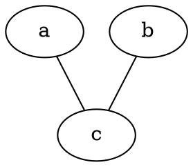

<hr><br>

### graphviz中布局器
graphviz中包含了众多布局器
1. dot默认布局方式，主要用于有向图
2. `neato `基于spring-model（又称为force-based）算法
3. `twopi `径向布局
4. `circo `圆环布局
5. `fdp `用于无向图


<hr><br>

### 绘图流程
graphviz的设计初衷是对有向图、无向图等进行自动布局，开发人员使用dot脚本定义图形元素，然后选择算法进行布局，最终导出结果。

首先，在dot脚本中定义图的顶点和边，顶点和边都具有各自的属性，比如形状，颜色，填充模式，字体，样式等。
然后使用合适的布局算法进行布局。布局算法除了绘制各个顶点和边之外，需要尽可能的将顶点均匀的分布在画布上，并且尽可能的减少边的交叉。
### 流程：
1. 定义一个图，并向图中添加需要的顶点和边
2. 为顶点和边添加样式
3. 使用布局引擎进行绘制


<hr>
<br>

### Digraph有向图

>\```dot
digraph g{
a->b
b->c
}
\```

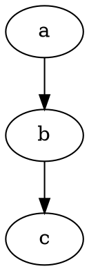


### 一些基本图像
1节点形状

> https://graphviz.gitlab.io/_pages/doc/info/shapes.html


> https://graphviz.gitlab.io/_pages/doc/info/shapes.html

<hr>
<br>

箭头形状

> https://graphviz.gitlab.io/_pages/doc/info/arrows.html

### 基本命令
生成图片
```
dot test.dot -T png -o D:/project/Learn/test.png
```

### 中文乱码
通常是缺少字体。解决方案：
- 生成svg的结果，而不是png
- 在dot文件中指定字体。


## 基本语法
1. 字符串都要加上双引号，可以使用`\n`换行
2. 注释使用双斜杠`\\` 或 `/**/`
3. 有向图 `digraph` ,节点关系：指向 `->`
4. 无向图 `graph` ,节点关系: 联通`--`
5. 属性 `node[attribute1=value1,attribute2=value2]`
   - 大小：size="2.2"，单位为英寸；
   - 标签：label="显示在图上的内容"
   - 边： edge[color=red,style=dotted]; 这句话之后生效
   - 节点 node[color=navy]；这句话之后生效
   - 边方向 rankdir=参数 ；LR（左->右），RL（右->左），BT(下->上)，TB(上->下)。
   - 节点形状：a[shape=box]；默认是椭圆。
   - 边框大小：a[width=.1,height=2.5]；单位为英寸
   - 边框颜色：a[color=red];

### 构造边
|**关系**|**有向图**|**无向图**|
|:--:|:--:|:--:|
|一对一|`a->b`|`a--b`|
|一对多|`a->{b;c;d}`|`a--{b;c;d}`|
|多对一|`{b;c;d}->a`|`{b;c;d}->a`|
|多对多|`{m,n,p,q}->{b;c;d}`|`{m,n,p,q}--{b;c;d}`|

### 详细资料
官方文档：http://www.graphviz.org/documentation/
属性设置：https://graphviz.gitlab.io/_pages/doc/info/attrs.html
节点形状：https://graphviz.gitlab.io/_pages/doc/info/shapes.html
箭头形状：https://graphviz.gitlab.io/_pages/doc/info/arrows.html
颜色配置：https://graphviz.gitlab.io/_pages/doc/info/colors.html

## 基本图形绘制
> \```dot
digraph G{
    {b;c;d}->a
}
\```

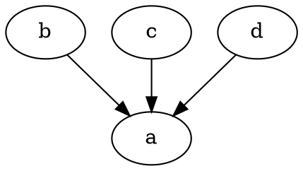

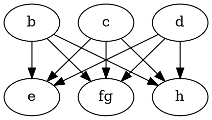


<hr><br>
<br>

## 示例

> \```dot
digraph g{
    //=============定义节点关系=========
    a->b;
    b->c;
    c->a;
    c->d->e->f;
    d->g;
    e->h;
    //============定义节点属性===========
    a[shape=box,label="Server1",fillcolor="#ABACBA",style=filled];
    b[shape=polygon,sides=5,label="bb",style=filled,fillcolor=red];
    d[shape=circle];  //圆
    e[shape=triangle]; //三角形
    f[shape=polygon,sides=4,skew=0.5] //平行四边形
    g[shape=polygon,distortion=0.5];//梯形，上边长
    h[shape=polygon,distortion=-0.5];//梯形，下边长
}
\````

#### 示例1
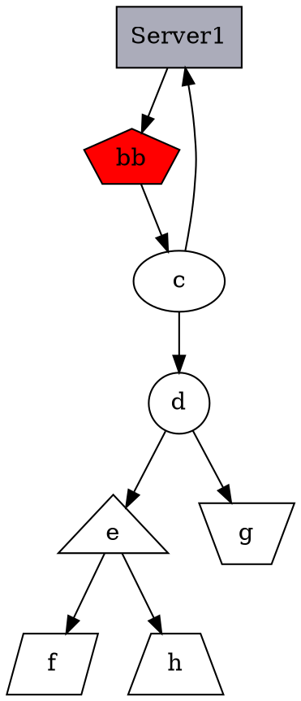

<hr>

#### 哈希表
>
\```dot
digraph g{
    nodesep=.5;
    rankdir=LR; //指定绘图的方向（从左向右）
    //定义竖直节点
    node[shape=record,width=.1,height=.1];
    node0[label="\<f0> f0|\<f1> f1|\<f2> f2|\<f3> f3|\<f4> f4|\<f5> f5|\<f6> f6", height=3];  //有7个属性
    //
    //===定义横向节点===
    node[width=1.5];
    node1[label="{\<n> a13|111|\<p>}"]  //也是一个节点，定义了3个属性；
    node2[label="{\<n> hello |\<c> 238 |\<p>}"];
    node3[label="{\<n> g23|344|\<p>}"];
    node4[label="{\<n> k535|246|\<p>}"];
    node5[label="{\<n> h25 |13|\<p>}"];
    node6[label="{\<n> dj|04|\<p>}"];
    node7[label="{\<n> sdb|0x543|\<p>}"];
    //建立节点之间的连接
    node0:f0->node1:\<p>;
    node0:f1->node2:c;
    node0:f2->node3:n;
    node0:f5->node4:n;
    node0:f6->node5:n;
    node0:p->node6:n;
    node0:p->node7:n;
}
\```

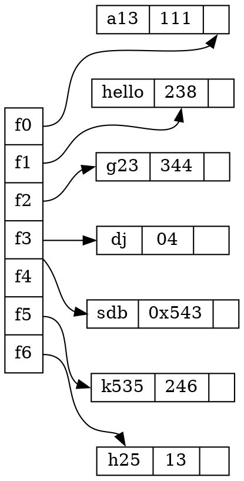


<hr>
<br>

### 定义结构

> 代码：
\```dot
digraph g{
    node[shape=record,height=.1];   //定义了下面的node样式
    //
    //==以下是一个node，三个属性，第二个属性名字A，其他两个属性为空==
    node0[label="<f0> |<f1> A|<f2> "];
    node1[label="<f0> |<f1> B|<f2> "];
    node2[label="<f0> |<f1> C|<f2> "];
    node3[label="<f0> |<f1> D|<f2> "];
    node4[label="<f0> |<f1> E|<f2> "];
    node5[label="<f0> |<f1> F|<f2> "];
    node6[label="<f0> |<f1> H|<f2> "];
    node7[label="<f0> |<f1> I|<f2> "];
    node8[label="<f0> |<f1> J|<f2> "];
    node9[label="<f0> |<f1> K|<f2> "];
    //
    //==node0的第三个属性连接到node1的第二个属性==
    "node0":f2->"node1":f1;
    "node1":f0->"node2":f1;
    "node1":f1->"node3":f2;
    "node3":f0->"node4":f0;
    "node3":f1->"node5":f1;
    "node3":f2->"node6":f2;
    "node6":f1->"node7":f1;
    "node7":f1->"node8":f0;
    "node2":f2->"node9":f1;
}
\```


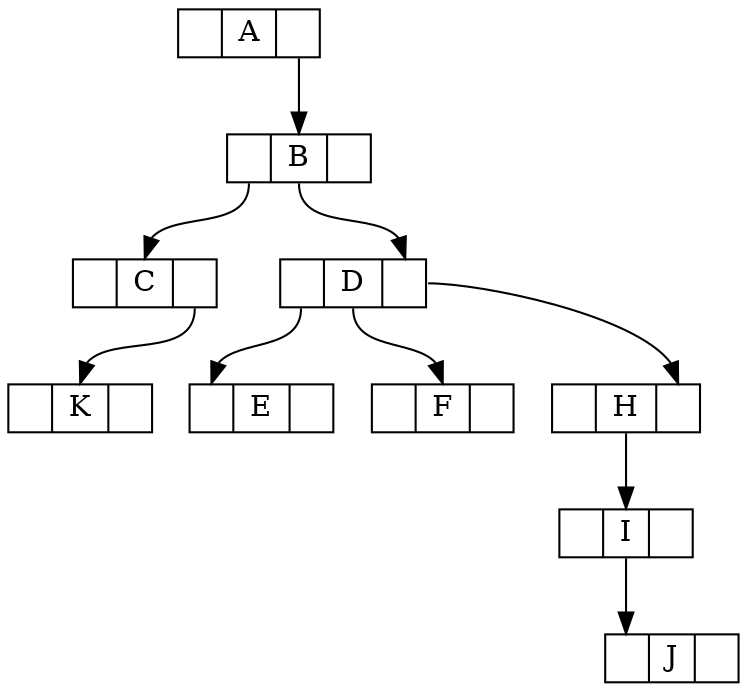

<hr>
<br>

### 使用subgraph定义子图
> 代码如下：
\```dot
digraph g{
    //==定义一个子图，subgraph定义子图==
    subgraph cluster0{
        node[style=filled,color=white]; //定义子图中的节点样式
        style=filled;                   //定义子图样式
        color=red;                      //定义子图填充颜色
        a0->a1->a2->a3;                 //定义节点，及节点之间的关系
        label="process #1"              //定义子图的标签
    }
    //
    //==定义另一个子图==
    subgraph cluster1{
        node[style=filled,color=white]; //定义子图中的节点样式
        style=filled;                   //定义子图样式
        color=blue;                      //定义子图填充颜色
        b0->b1->b2->b3;                 //定义节点，及节点之间的关系
        label="process #2" 
    }
    //
    //==定义子图之间的关系==
    start->a0;
    start->b0;
    a1->b3;
    b2->a3;
    a3->end;
    b3->end;
}
\```

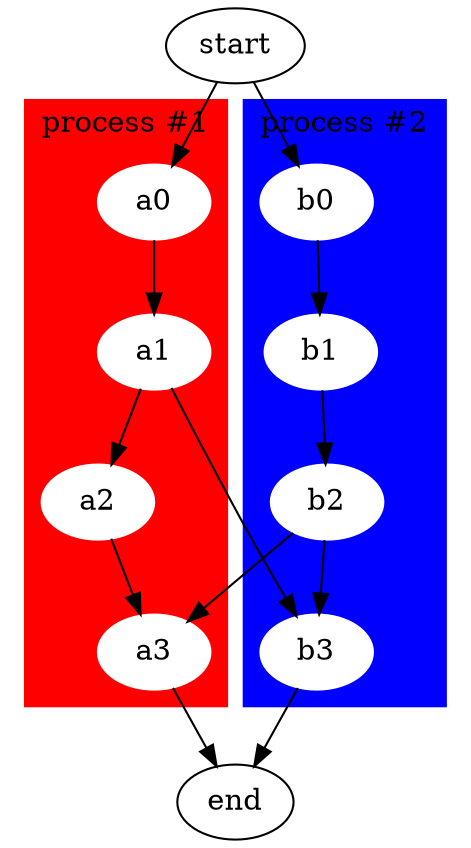

<hr><br>

### 常用的颜色如下：
常用颜色


<hr><br>

### 定义关系的样式（节点之间的连线样式）

> 代码：
\```dot
digraph g{
    //==edge[style=dashed];定义边的样式，虚线==
    node[peripheries=2,style=filled,color="#eecc80"];
    a->b [color=red,style=dashed];   //定义边的颜色，b和方括号之间必须有空格
    b->c;                            //箭头，三角形；箭尾，菱形
    b->d [arrowhead=box];           //箭头，长方形     
    b->e [dir=none];                //没有箭头
    d->f [dir=both];                //双向箭头
    f->h [label=go];                //定义edge的标签
    f->k [arrowhead=diamond];       //更改箭头形状
    k->y [headlabel="哈哈",taillabel="嘻嘻"];      
}
\```


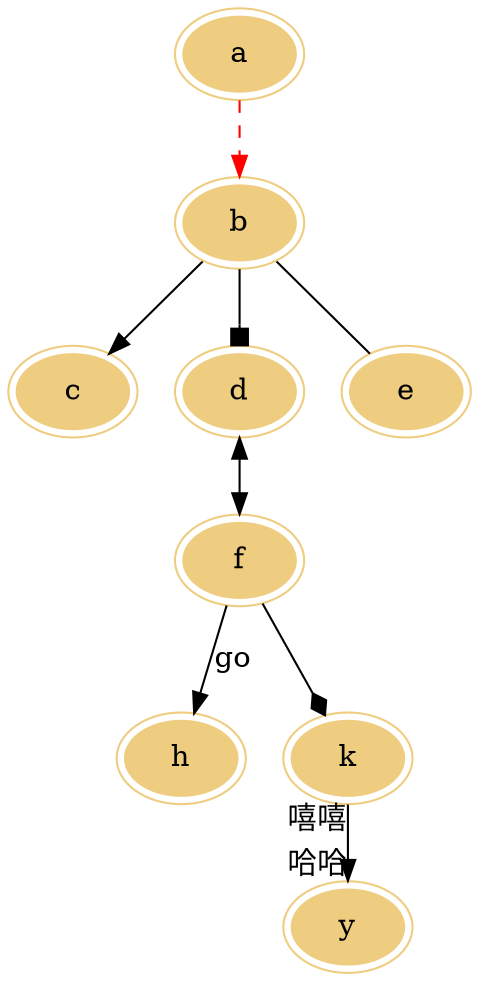

<hr>
<br>

### 无向图
> 代码：
\```dot
graph g{
   edge[style=dashed];      //定义边的样式，虚线
   a--b [color=red];        //定义边的颜色，红色 
}
\```

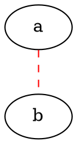


<hr><br>

### 子图
> 代码：
\```dot
digraph abc{
    node [shape="record"];
    edge [style="dashed"];
    a [style="filled"]
    b;
    //==子图==
    subgraph cluster_cd{
        label="c and d";
        bgcolor="mintcream";
        c;
        d;
    }
    //...
    a->b;
    b->d;
    c->d [color="red"]
}
\```


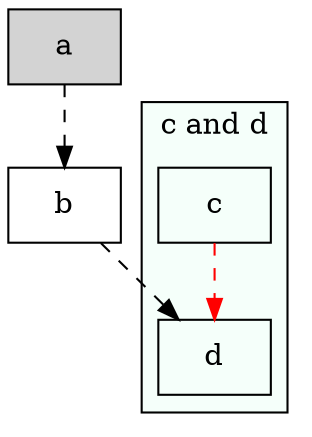

> 子图的名称必须以cluster开头，否则graphviz无法识别。


<hr><br>

### 数据结构的可视化
在实际开发中，经常要用到的是对复杂数据结构的描述，graphviz提供完善的机制来绘制此类图形。

一个hash表的数据结构
> 代码：
\```dot
struct st_st_hash_type{
    int (*compare) ();
    int (*hash) ();
};
//
struct st_table_entry{
    unsigned int hash;
    char *key;
    char *record;
    st_table_entry *next;
};
//
struct st_table{
    struct st_hash_type *type;
    int num_bins;     //插入 count*
    int num_entries;    //统计实体
    struct st_table_entry **bins;
};
//
//
digraph st2{
    fontname="Verdana";
    fontsize=10;
    rankdir=TB;
//
    node [fontname="Verdana",fontsize=10,color="skyblue",shape="record"];
//
    edge [fontname="Verdana",fontsize=10,color="crimson",style="solid"];
//
    st_has_type [label="{<head>st_hash_type|(*compare)|(*hash)}"];
//    
    st_table_entry [label="{<head>st_table_entry|hash|key|record|<next>next}"];
//
    st_table [label="{st_table|<type>type|num_bins|num_entries|<bins>bins}"];
//
    st_table:bins->st_table_entry:head;
    st_table:type->st_hash_type:head;
//
    st_table_entry:next->st_table_entry:head [style="dashed",color="forestgreen"];
}
\```


<hr><br>

### 软件模块组成图
Apache httpd模块关系
IDPV2后台的模块组成关系
在实际开发中，随着系统功能的完善，软件整体的结构会越来越复杂，通常开发人员会将软件划分为可理解的多个字模块，各个模块通过协作，完成各种各样的需求。

IDP 支持曾为一个相对独立的子系统，齐总包括如数据库管理器，配置信息管理器等模块，另外为了提供更大的灵活性，将很多其他模块抽取出来作为外部模块，而支持层提供了一个模块管理器，来负责加载/卸载这些外部的模块集合。

这些模块间的关系较为复杂，并且有部分模块关系密切，应归类为一个子系统。
> 代码如下:
\```dot
digraph idp_modules{
    rankdir=TB;
    fontname="Microsoft YaHei";
    fontsize=12;
    //==节点==
    node [fontname="Microsoft YaHei",fontsize=12,shape="record"];
    edge [fontname="Microsoft YaHei",fontsize=12];
    //
    //==子模块==
    subgraph cluster_sl{
        label="IDP 支持层";
        bgcolor="mintcream";
        node [shape="Mrecord",color="skyblue",style="filled"];
        network_mgr [label="网络管理器"];
        log_mgr [label="日志管理器"];
        module_mgr [label="模块管理器"];
        conf_mgr [label="配置管理器"];
        db_mgr [label="数据库管理器"];
    };
    //
    //==字模块==
    subgraph cluster_md{
        label="可插拔模块集";
        bgcolor="lightcyan";
        node [color="chartreuse2",style="filled"];
        mod_dev [label="开发支持模块"];
        mod_dm [label="数据建模模块"];
        mod_dp [label="部署发布模块"];
    };
    //
    //==连接关系==
    mod_dp->mod_dev [label="依赖..."];
    mod_dp->mod_dm [label="依赖..."];
    mod_dp->module_mgr [label="安装...",color="yellowgreen",arrowhead="none"];
    mod_dev->mod_dm [label="依赖..."];
    mod_dev->module_mgr [label="安装...",color="yellowgreen",arrowhead="none"];
    mod_dm->module_mgr [label="安装...",color="yellowgreen",arrowhead="none"];
}
\```


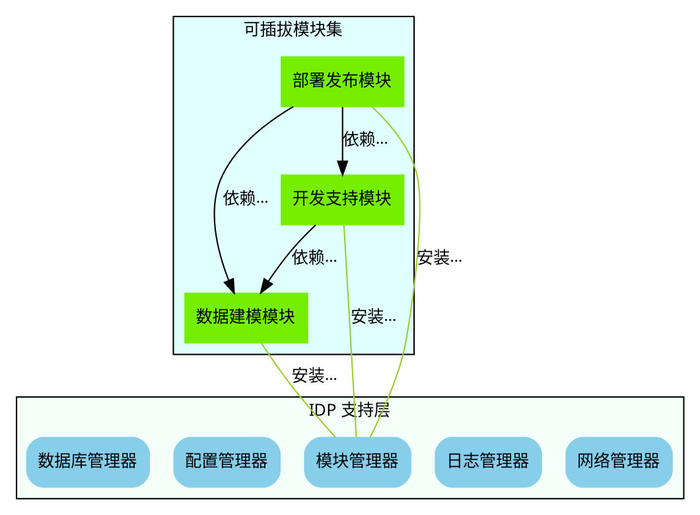


<hr><br>

### 状态图
有限自动机示意图
>代码：
\```dot
digraph automata_0{
    size="100.15,400";
    fontname="Microsoft YaHei";
    fontsize=10;
    //
    //
    node [shape=circle,fontname="Microsoft YaHei",fontsize=10];
    edge [fontname="Microsoft YaHei",fontsize=10];
    //
    //
    0 [style=filled,color=lightgrey];
    2 [shape=doublecircle];
    //
    //
    0->2 [label="  a"];
    0->1 [label="   other"];
    1->2 [label="   a"];
    1->1 [label="    other"];
    2->2 [label="   a"]
    2->1 [label="    other"];
    //
    //
    "Machine: a" [shape=plaintext];
    //性状值为plaintext的表示不用绘制边框，仅仅展示纯文本内容，这个在绘图中，绘图指示性的文本时很有用。如本图的“ Machine：a ”
}
\```


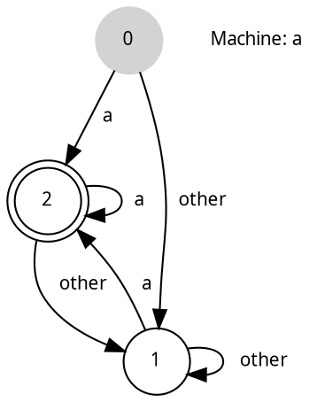


<hr><br>

### OSGi中模块的声明周期图
OSGi中，模块具有生命周期，从安装到卸载，可能的状态具有已安装、已就绪、正在启动、已启动、正在停止，已卸载等。
> 代码:
\```dot
digraph module_lc{
    rankdir=TB;
    fontname="Microsoft YaHei";
    fontsize=12;
    //==总体定义==
    node [fontname="Microsoft YaHei",fontsize=12,shape="Mrecord",color="skyblue",style="filled"];
    edge [fontname="Microsoft YaHei",fontsize=12,color="darkgreen"];
    //==节点定义==
    installed [label="已安装状态"];
    resolved [label="已就绪状态"];
    uninstalled [label="已卸载状态"];
    starting [label="正在启动"];
    active [label="已激活（运行）状态"];
    stopping [label="正在停止"];
    start [label=" ",shape="circle",width=0.5,fixedsize=true,style="filled",color="balck"];
    //==连接定义==
    start->installed [label="安装"];
    installed->uninstalled [label="卸载"];
    installed->resolved [label="准备",width=1.5,color="red"];
    installed->installed [label="更新"];
    resolved->installed [label="更新"];
    resolved->starting [label="启动"];
    starting->active [label=" "];
    active->stopping [label="停止"];
    stopping->resolved [label=" "];
}
\```


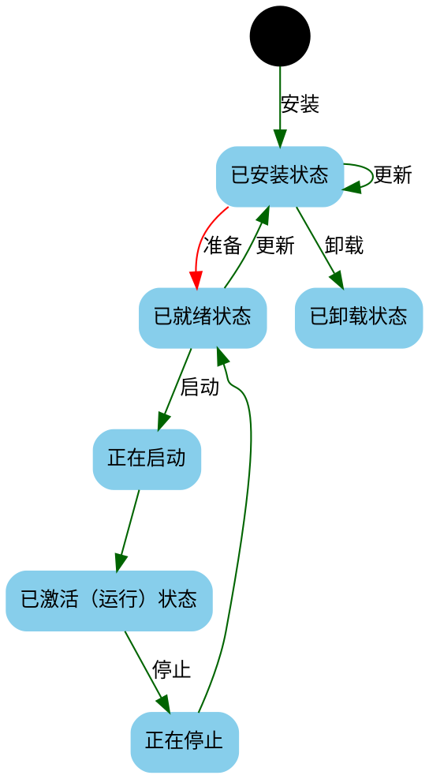


<hr><br>

### 其他实例
一个简单的抽象语法树（AST）
表达式（3+4）*5在编译时期，会形成一颗语法树，一边在计算时，先计算3+4的值，最后与5相乘。
> 代码：
\```dot
digraph ast{
    fontname="Microsoft YaHei";
    fontsize=15;
    //
    node [shape=circle,fontname="Microsoft YaHei",fontsize=15];
    edge [fontname="Microsoft YaHei",fontsize=15];

    //
    mul [label="mul(*)"];
    add [label="add(+)"];
    //
    add -> 3;
    add -> 4;
    mul -> add;
    mul -> 5;
}
\```


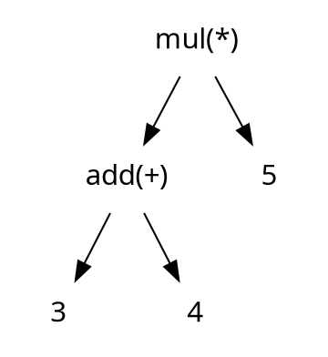

<hr><br>

### graphviz 绘制UML类图
这里对Context的定义，Context是用户自定义的节点（Context写成什么没关系，label不能写错）。使用了node属性，其中label属性是一个字符串，这里` | `表示换行， `\l(L)`也就是空行的意思，占用一个空行。注意，使用{}吧内容括起来。
> 代码：
\```dot
digraph G{
    node [shape=record]
    {rank=LR;Context;Strategy}
    //
    Context[label="{Context| +strategy : Strategy\l|+contextInterface()\l}"]
    //
    docs [style="filled",color="gold",label="Strategy AlgorithmInterface()"]
    Strategy [label="{Strategy|\l|+algorithmInterface()\l}"];
    ca [label="{ConcreteStrategyA|\l+algorithmInterface()\l}"];
    cb [label="{ConcreteStrategyB|\l+algorithmInterface()\l}"];
    cc [label="{ConcreteStrategyC|\l+algorithmInterface()\l}"];
    //
    Strategy -> Context
    Context->docs
    {rank=same;ca;cb;cc;docs}
    ca -> Strategy
    cb -> Strategy
    cc -> Strategy
}
\```


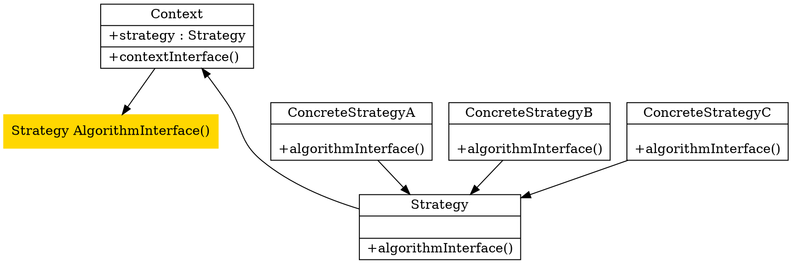


<hr><br>

### 类图
UML类图是最常见的图形，用于表示系统的静态结构，UML中类是以矩形表示。我们可以在dot文件中预设节点的形状，并且设置一些如字体等属性。
> 代码：
\```dot
digraph{
    node [shape=box,fontname="Inconsolata,Consolas",fontsize=15,penwidth=0.5]
    /* */
    Foo
    Bar
}
\```

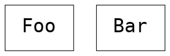


#### 继承
继承是类之间很重要的关系，在UML中又称其为泛华关系，以空心箭头表示派生类指向基类。在DOT中，可以设置边的箭头形状，
> 代码：
\```dot
digraph{
    node [shape=box,fontname="Inconsolata,Consolas",fontsize=15,penwidth=0.5]
    /* 类 */
    Animal,Mammal,Reptile,Dog,Cat,Snake
    {
        /* dir=back 为逆向箭头*/
        edge [arrowtail=onormal,dir=back]
        Animal -> {Mammal,Reptile}
        Mammal -> {Dog,Cat}
        Reptile -> Snake
    }
}
\```

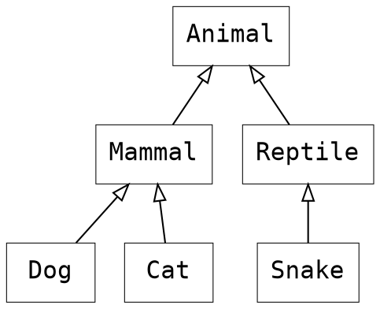

#### 关联
UML中关联描述两个类的关系，以类之间的实线表示。例如人和杂志的关系时订阅:
> 代码：
\```dot
digraph{
    node [shape=box,fontname="Inconsolata,Consolas",fontsize=15,penwidth=0.5];
    /*定义关系*/
    Person,Magazine
    {
        /* subscribe——订阅*/
        edge [dir=none]
        Person -> Magazine [label="subscribe(订阅)"]
    }
}
\```


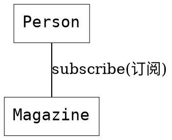


#### 多重关系
我们经常会表示关联之间的多重性，例如`Person`类的实例最多可订阅5本杂志，而每本杂志可以被任意数目的人订阅：
> 代码：
\```dot
digraph{
    node [shape=box,fontname="Inconsolata,Consolas",fontsize=15,penwidth=0.5];
    edge [fontname="Inconsolata,Consolas",fontsize=10,penwidth=0.5];
    /**/
    Person,Magazine
    /*Association with multiplicity*/
    {
        /* subscribe——订阅*/
        edge [dir=none]
        Person -> Magazine [label="   subscribe(订阅)",headlabel="0..10  ",taillabel="* "]
       /*注意上面例子 label、headlabel、taillabel加入空格避免他们贴的太近.*/
    }
}
\```


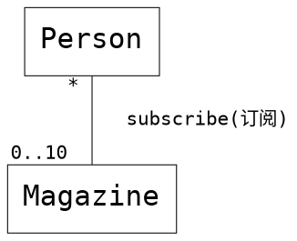
关联可以是单向或双向的，以线性箭头表示，无箭头表示双向关联。
> Interviewer -> Candidate [arrowhead=vee]


#### 聚合
聚合是一种特殊的关系，是一种弱的包含关系，包含方以空心菱形表示，例如一个部门包含一些员工：
> 代码：
\```dot
digraph{
    node [shape=box,fontname="Inconsolata,Consolas",fontsize=15,penwidth=0.5];
    edge [fontname="Inconsolata,Consolas",fontsize=10,penwidth=0.5];
    /**/
    Department,Employee
    /**/
    /*Association with multiplicity*/
    {
        /* subscribe——订阅*/
        edge [dir=back,arrowtail=odiamond,headlabel="* "]
        Department -> Employee
    /**/
    }
}
\```

```dot
digraph{
    node [shape=box,fontname="Inconsolata,Consolas",fontsize=15,penwidth=0.5];
    edge [fontname="Inconsolata,Consolas",fontsize=10,penwidth=0.5];

    Department,Employee

    /*Association with multiplicity*/
    {
        /* subscribe——订阅*/
        edge [dir=back,arrowtail=odiamond,headlabel="* "]
        Department -> Employee

    }
}
```

#### 组成
组成是更强的包含关系，说明一个类的实例时另一个类的组成部分，他们有一致的生命周期，组成方以实心菱形表示。例如一家公司由多个部门组成，如果公司结业，部门就不存在了。
> 代码：
\```dot
digraph{
    node [shape=box,fontname="Inconsolata,Consolas",fontsize=15,penwidth=0.5];
    edge [fontname="Inconsolata,Consolas",fontsize=10,penwidth=0.5];
    /*以下公司、部门、员工*/
    Company,Department,Employee
    /**/
    /*公司和部门的关系*/
    {
        /* subscribe——订阅*/
        edge [dir=back,arrowtail=diamond,headlabel="* "]
        Company -> Department
    }
    /**/
    /*部门和员工的关系*/
    {
        /* subscribe——订阅*/
        edge [dir=back,arrowtail=odiamond,headlabel="* "]
        Department -> Employee
    }
}
\```


```dot
digraph{
    node [shape=box,fontname="Inconsolata,Consolas",fontsize=15,penwidth=0.5];
    edge [fontname="Inconsolata,Consolas",fontsize=10,penwidth=0.5];
    /*以下公司、部门、员工*/
    Company,Department,Employee
    /**/
    /*公司和部门的关系*/
    {
        /* subscribe——订阅*/
        edge [dir=back,arrowtail=diamond,headlabel="* "]
        Company -> Department
    }
    /**/
    /*部门和员工的关系*/
    {
        /* subscribe——订阅*/
        edge [dir=back,arrowtail=odiamond,headlabel="* "]
        Department -> Employee
    }
}
```


#### 依赖
依赖（depedency）说明一个类会使用到另一个类，例如表示以一个类作为成员方法的参数或返回值。UML中采用线性箭头和虚线表示。
以下是表示工厂创建产品，常用于各种工厂模式，工厂不拥有产品。
> 代码：
\```dot
digraph{
    node [shape=box,fontname="Inconsolata,Consolas",fontsize=15,penwidth=0.5];
    edge [fontname="Inconsolata,Consolas",fontsize=10,penwidth=0.5];
    /*工厂和产品*/
    Factory,Product
    /**/
    /*生产关系*/
    {
        edge [arrowtail=vee,style="dashed"]
        Factory -> Product [label="   <<create>>"]
    }
}
\```


```dot
digraph{
    node [shape=box,fontname="Inconsolata,Consolas",fontsize=15,penwidth=0.5];
    edge [fontname="Inconsolata,Consolas",fontsize=10,penwidth=0.5];
    /*工厂和产品*/
    Factory,Product
    /**/
    /*生产关系*/
    {
        edge [arrowtail=vee,style="dashed"]
        Factory -> Product [label="   <<create>>"]
    }
}
```


### 类成员
类除了名字，可以展示其成员。成员包括属性（attribute）和方法（method）。
每个成员的可见性（visibility）以一个前置符号表示：
1. `+ ` 公有（public）
2. ` -` 私有（private）
3. `# ` 保护（protected）
4. ` ~` 包（package）

如果成员为静态`static`的，则是下划线

属性的格式：
`<visibility> <attribute name>:<type>`

方法格式：
`<visibility> <method name> (<param1 name>:<param1 type>,...): <return type>`

Graphviz可以使用record shape或HTML Table来分隔名字，属性和方法。
> 代码：
\```dot
digraph{
    node [shape=record,fontname="Inconsolata,Consolas",fontsize=10,penwidth=0.5,width="2.5"];
    /**/
    Account [label="{
        Account
        |
        # balance : int\l
        - owner : string\l
        |
        + Deposite(amount : int)\l
        + Withdraw(amount : int)\l
        + GetBalance() : int\l
    }"]
}
\```
其中 `\l(L)`表示该行向左对齐并换行。

```dot
digraph{
    node [shape=record,fontname="Inconsolata,Consolas",fontsize=10,penwidth=0.5,width="2.5"];

    Account [label="{
        Account
        |
        # balance : int\l
        - owner : string\l
        |
        + Deposite(amount : int)\l
        + Withdraw(amount : int)\l
        + GetBalance() : int\l
    }"]
}
```


#### 包
在比较大的系统里，类通常会用包（package）的方式来组织。Graphviz不能简单还完UML包的图形，但可以使用subgraph cluster功能去近似的表示类属于那个包。
> 代码：
\```dot
digraph{
    graph [fontname="Microsoft YaHei",fontsize=10,penwidth=0.5,labeljust=left]
    node [shape=box,fontname="Microsoft YaHei",fontsize=10,penwidth=0.5]
    edge [fontname="Microsoft YaHei",fontsize=10,penwidth=0.5]
    /*子图*/
    subgraph clusterView {
        label="View"
        AccountView,CustomerView
    }
    /*子图*/
    subgraph clusterModel {
        label="Model"
        Account,Customer
    }
    /*关系*/
    {
        edge [arrowhead=vee]
        AccountView -> Account
        CustomerView -> Customer
    }
    /*注意`subgraph` 的名字必须以cluster为前缀*/
}
\```


```dot
digraph{
    graph [fontname="Microsoft YaHei",fontsize=10,penwidth=0.5,labeljust=left]
    node [shape=box,fontname="Microsoft YaHei",fontsize=10,penwidth=0.5]
    edge [fontname="Microsoft YaHei",fontsize=10,penwidth=0.5]

    subgraph clusterView {
        label="View"
        AccountView,CustomerView
    }

    subgraph clusterModel {
        label="Model"
        Account,Customer
    }

    /*关系*/
    {
        edge [arrowhead=vee]
        AccountView -> Account
        CustomerView -> Customer
    }
    /*注意`subgraph` 的名字必须以cluster为前缀*/
}
```


#### 排布技巧
例如，dot描述的是有向图，从来源节点指向目标节点时，目标节点就会成为下一级，预设设置下，节点会垂直排列。
> 代码：
\```dot
digraph{
    node [shape=box,fontname="Microsoft YaHei",fontsize=10,penwidth=0.5]
    /**/
    Canvas,Shape,Rectangle,Circle
    /* Inheritance */
    {
        edge [arrowtail=onormal,dir=back]
        Shape -> {Rectangle,Circle}
    }
    /*Composition*/
    {
        edge [dir=back,arrowtail=diamond,headlabel="* "]
        Canvas -> Shape
    }
}
\```

```dot
digraph{
    node [shape=box,fontname="Microsoft YaHei",fontsize=10,penwidth=0.5]

    Canvas,Shape,Rectangle,Circle
    /* Inheritance */
    {
        edge [arrowtail=onormal,dir=back]
        Shape -> {Rectangle,Circle}
    }
    /*Composition*/
    {
        edge [dir=back,arrowtail=diamond,headlabel="* "]
        Canvas -> Shape
    }
}
```

但有时候我们做一些修改，例如继承沿用这种方式，但关联时以水平。我们可以使用rank=same去设置一组节点为同一级，节点之间的距离可整体设置 `nodesep`属性：
> 代码：
\```dot
digraph{
    graph [nodesep=1]   //节点之间的距离
    node [shape=box,fontname="Microsoft YaHei",fontsize=10,penwidth=0.5]
    /*Canvas和Shape同一级*/
    {
        rank=same
        Canvas,Shape
    }
    /*Rectangle和Circle同一级*/
    {
        rank=same
        Rectangle,Circle
    }
    /* Inheritance */
    {
        edge [arrowtail=onormal,dir=back]
        Shape -> {Rectangle,Circle}
    }
    /*Composition*/
    {
        edge [dir=back,arrowtail=diamond,headlabel="* "]
        Canvas -> Shape
    }
}
\```


```dot
digraph{
    graph [nodesep=1]   //节点之间的距离
    node [shape=box,fontname="Microsoft YaHei",fontsize=10,penwidth=0.5]
    /*Canvas和Shape同一级*/
    {
        rank=same
        Canvas,Shape
    }
    /*Rectangle和Circle同一级*/
    {
        rank=same
        Rectangle,Circle
    }
    /* Inheritance */
    {
        edge [arrowtail=onormal,dir=back]
        Shape -> {Rectangle,Circle}
    }
    /*Composition*/
    {
        edge [dir=back,arrowtail=diamond,headlabel="* "]
        Canvas -> Shape
    }
}
```


#### 颜色
UML图也不一定是黑白的。做软件设计时可以加入颜色。可以使用Graphviz的配色方案，例如 `colorscheme=spectral7` 设置7个光谱色配色方案，然后使用`fillcolor=1 至7 填充`节点形状。
> 代码：
\```dot
digraph{
    graph [fontname="Microsoft YaHei",fontsize=10,penwidth=0.5,labeljust=left]   //节点之间的距离
    node [shape=box,fontname="Microsoft YaHei",fontsize=10,penwidth=0.5,style=filled,colorscheme=spectral7]
    edge [fontname="Microsoft YaHei",fontsize=10,penwidth=0.5];
    /**/
    /*以下是子图*/
    subgraph clusterView{
        label="View"
        node [fillcolor=4]
        AccountView,CustomerView
    }
    /**/
    /*子图*/
    subgraph clusterModel{
        label="Model"
        node [fillcolor=6]
        Account,Customer
    }
    /**/
    /*连接关系*/
    {
        edge [arrowhead=vee]
        AccountView -> Account
        CustomerView -> Customer
    }
}
\```


```dot
digraph{
    graph [fontname="Microsoft YaHei",fontsize=10,penwidth=0.5,labeljust=left]   //节点之间的距离
    node [shape=box,fontname="Microsoft YaHei",fontsize=10,penwidth=0.5,style=filled,colorscheme=spectral7]
    edge [fontname="Microsoft YaHei",fontsize=10,penwidth=0.5];
    /**/
    /*以下是子图*/
    subgraph clusterView{
        label="View"
        node [fillcolor=4]
        AccountView,CustomerView
    }
    /**/
    /*子图*/
    subgraph clusterModel{
        label="Model"
        node [fillcolor=6]
        Account,Customer
    }
    /**/
    /*连接关系*/
    {
        edge [arrowhead=vee]
        AccountView -> Account
        CustomerView -> Customer
    }
}
```