# Graphviz
Graphviz是贝尔实验室开发的一套“所向即所得”的画流程图工具。

### 优势
- 纯文本编辑
- 适合git管理
- git管理后，协作编辑就方便

## Windows平台下
- 下载安装配置环境变量
  - Install
  - 配置环境变量
  - 验证
- 基本绘图入门
  - graph
  - digraph
  - 一个复杂的例子
- 和python交互

## 下载安装、配置环境变量
### install
Windows版本[下载地址](http://www.graphviz.org/download/) 
> http://www.graphviz.org/download/

### 配置环境变量
==将graphviz安装目录下的bin文件夹添加到path环境变量中==

### 验证
进入命令提示符，输入 `dot -version` ，会显示相关版本信息。

### 建议使用 Visual Studio Code安装插件。
安装Graphviz(dot) language support for visual studio code 扩展

<hr>
<br>

## 基本概念
Graphviz分为两种类型的图
- Graph没有方向的图，元素之间只有连接，没有箭头方向
- Digraph元素之间，用带方向的箭头连接，Direction Graph

### Graph无向图
>\```dot
graph a{
a--b
b--c
}
\```
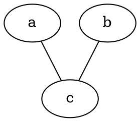

<hr><br>

### graphviz中布局器
graphviz中包含了众多布局器
1. dot默认布局方式，主要用于有向图
2. `neato `基于spring-model（又称为force-based）算法
3. `twopi `径向布局
4. `circo `圆环布局
5. `fdp `用于无向图


<hr><br>

### 绘图流程
graphviz的设计初衷是对有向图、无向图等进行自动布局，开发人员使用dot脚本定义图形元素，然后选择算法进行布局，最终导出结果。

首先，在dot脚本中定义图的顶点和边，顶点和边都具有各自的属性，比如形状，颜色，填充模式，字体，样式等。
然后使用合适的布局算法进行布局。布局算法除了绘制各个顶点和边之外，需要尽可能的将顶点均匀的分布在画布上，并且尽可能的减少边的交叉。
### 流程：
1. 定义一个图，并向图中添加需要的顶点和边
2. 为顶点和边添加样式
3. 使用布局引擎进行绘制


<hr>
<br>

### Digraph有向图

>\```dot
digraph g{
a->b
b->c
}
\```

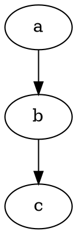


### 一些基本图像
1节点形状
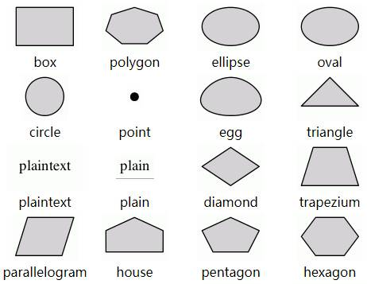
> https://graphviz.gitlab.io/_pages/doc/info/shapes.html

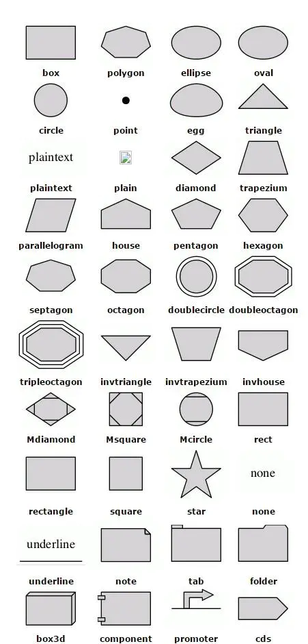
> https://graphviz.gitlab.io/_pages/doc/info/shapes.html

<hr>
<br>

箭头形状
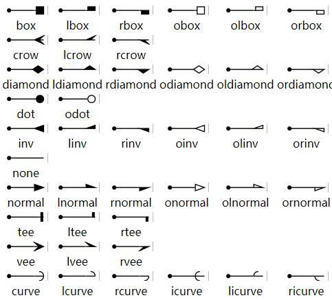
> https://graphviz.gitlab.io/_pages/doc/info/arrows.html

### 基本命令
生成图片
```
dot test.dot -T png -o D:/project/Learn/test.png
```

### 中文乱码
通常是缺少字体。解决方案：
- 生成svg的结果，而不是png
- 在dot文件中指定字体。


## 基本语法
1. 字符串都要加上双引号，可以使用`\n`换行
2. 注释使用双斜杠`\\` 或 `/**/`
3. 有向图 `digraph` ,节点关系：指向 `->`
4. 无向图 `graph` ,节点关系: 联通`--`
5. 属性 `node[attribute1=value1,attribute2=value2]`
   - 大小：size="2.2"，单位为英寸；
   - 标签：label="显示在图上的内容"
   - 边： edge[color=red,style=dotted]; 这句话之后生效
   - 节点 node[color=navy]；这句话之后生效
   - 边方向 rankdir=参数 ；LR（左->右），RL（右->左），BT(下->上)，TB(上->下)。
   - 节点形状：a[shape=box]；默认是椭圆。
   - 边框大小：a[width=.1,height=2.5]；单位为英寸
   - 边框颜色：a[color=red];

### 构造边
|**关系**|**有向图**|**无向图**|
|:--:|:--:|:--:|
|一对一|`a->b`|`a--b`|
|一对多|`a->{b;c;d}`|`a--{b;c;d}`|
|多对一|`{b;c;d}->a`|`{b;c;d}->a`|
|多对多|`{m,n,p,q}->{b;c;d}`|`{m,n,p,q}--{b;c;d}`|

### 详细资料
官方文档：http://www.graphviz.org/documentation/
属性设置：https://graphviz.gitlab.io/_pages/doc/info/attrs.html
节点形状：https://graphviz.gitlab.io/_pages/doc/info/shapes.html
箭头形状：https://graphviz.gitlab.io/_pages/doc/info/arrows.html
颜色配置：https://graphviz.gitlab.io/_pages/doc/info/colors.html

## 基本图形绘制
> \```dot
digraph G{
    {b;c;d}->a
}
\```

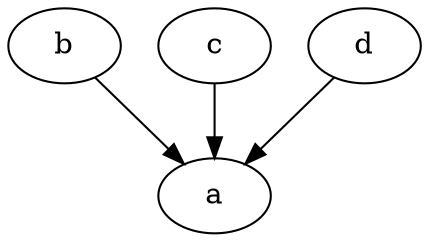

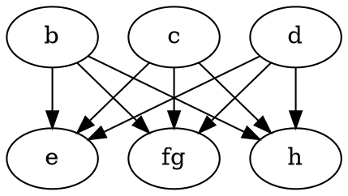


<hr><br>
<br>

## 示例

> \```dot
digraph g{
    //=============定义节点关系=========
    a->b;
    b->c;
    c->a;
    c->d->e->f;
    d->g;
    e->h;
    //============定义节点属性===========
    a[shape=box,label="Server1",fillcolor="#ABACBA",style=filled];
    b[shape=polygon,sides=5,label="bb",style=filled,fillcolor=red];
    d[shape=circle];  //圆
    e[shape=triangle]; //三角形
    f[shape=polygon,sides=4,skew=0.5] //平行四边形
    g[shape=polygon,distortion=0.5];//梯形，上边长
    h[shape=polygon,distortion=-0.5];//梯形，下边长
}
\````

#### 示例1
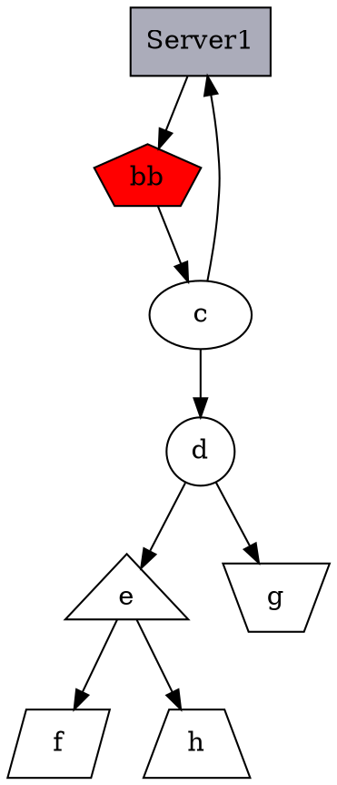

<hr>

#### 哈希表
>
\```dot
digraph g{
    nodesep=.5;
    rankdir=LR; //指定绘图的方向（从左向右）
    //定义竖直节点
    node[shape=record,width=.1,height=.1];
    node0[label="\<f0> f0|\<f1> f1|\<f2> f2|\<f3> f3|\<f4> f4|\<f5> f5|\<f6> f6", height=3];  //有7个属性
    //
    //===定义横向节点===
    node[width=1.5];
    node1[label="{\<n> a13|111|\<p>}"]  //也是一个节点，定义了3个属性；
    node2[label="{\<n> hello |\<c> 238 |\<p>}"];
    node3[label="{\<n> g23|344|\<p>}"];
    node4[label="{\<n> k535|246|\<p>}"];
    node5[label="{\<n> h25 |13|\<p>}"];
    node6[label="{\<n> dj|04|\<p>}"];
    node7[label="{\<n> sdb|0x543|\<p>}"];
    //建立节点之间的连接
    node0:f0->node1:\<p>;
    node0:f1->node2:c;
    node0:f2->node3:n;
    node0:f5->node4:n;
    node0:f6->node5:n;
    node0:p->node6:n;
    node0:p->node7:n;
}
\```

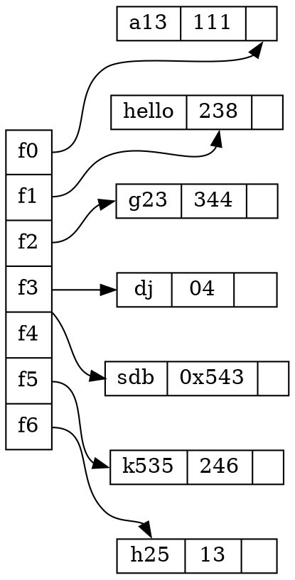


<hr>
<br>

### 定义结构

> 代码：
\```dot
digraph g{
    node[shape=record,height=.1];   //定义了下面的node样式
    //
    //==以下是一个node，三个属性，第二个属性名字A，其他两个属性为空==
    node0[label="<f0> |<f1> A|<f2> "];
    node1[label="<f0> |<f1> B|<f2> "];
    node2[label="<f0> |<f1> C|<f2> "];
    node3[label="<f0> |<f1> D|<f2> "];
    node4[label="<f0> |<f1> E|<f2> "];
    node5[label="<f0> |<f1> F|<f2> "];
    node6[label="<f0> |<f1> H|<f2> "];
    node7[label="<f0> |<f1> I|<f2> "];
    node8[label="<f0> |<f1> J|<f2> "];
    node9[label="<f0> |<f1> K|<f2> "];
    //
    //==node0的第三个属性连接到node1的第二个属性==
    "node0":f2->"node1":f1;
    "node1":f0->"node2":f1;
    "node1":f1->"node3":f2;
    "node3":f0->"node4":f0;
    "node3":f1->"node5":f1;
    "node3":f2->"node6":f2;
    "node6":f1->"node7":f1;
    "node7":f1->"node8":f0;
    "node2":f2->"node9":f1;
}
\```


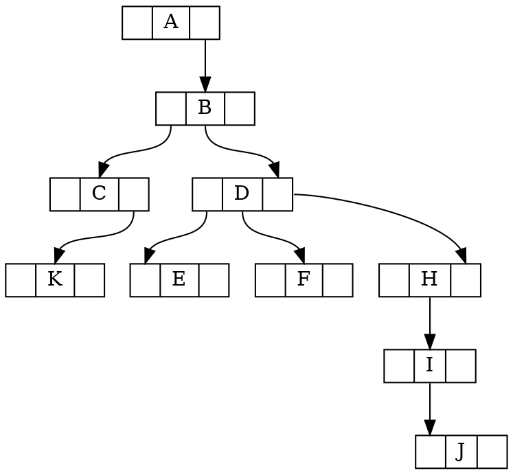

<hr>
<br>

### 使用subgraph定义子图
> 代码如下：
\```dot
digraph g{
    //==定义一个子图，subgraph定义子图==
    subgraph cluster0{
        node[style=filled,color=white]; //定义子图中的节点样式
        style=filled;                   //定义子图样式
        color=red;                      //定义子图填充颜色
        a0->a1->a2->a3;                 //定义节点，及节点之间的关系
        label="process #1"              //定义子图的标签
    }
    //
    //==定义另一个子图==
    subgraph cluster1{
        node[style=filled,color=white]; //定义子图中的节点样式
        style=filled;                   //定义子图样式
        color=blue;                      //定义子图填充颜色
        b0->b1->b2->b3;                 //定义节点，及节点之间的关系
        label="process #2" 
    }
    //
    //==定义子图之间的关系==
    start->a0;
    start->b0;
    a1->b3;
    b2->a3;
    a3->end;
    b3->end;
}
\```

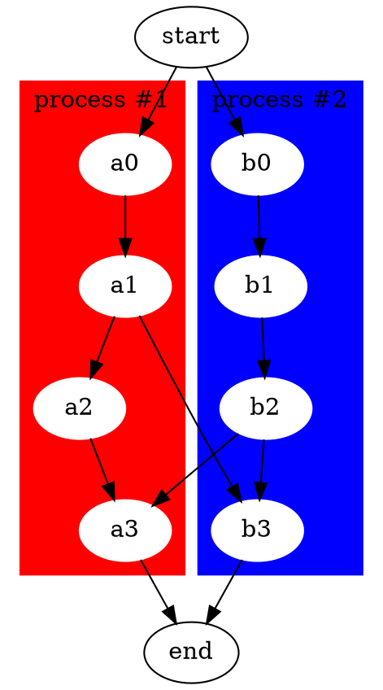

<hr><br>

### 常用的颜色如下：
常用颜色
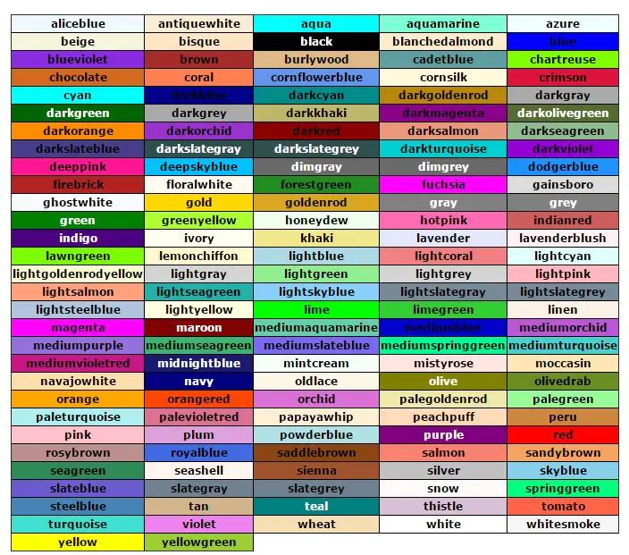


<hr><br>

### 定义关系的样式（节点之间的连线样式）

> 代码：
\```dot
digraph g{
    //==edge[style=dashed];定义边的样式，虚线==
    node[peripheries=2,style=filled,color="#eecc80"];
    a->b [color=red,style=dashed];   //定义边的颜色，b和方括号之间必须有空格
    b->c;                            //箭头，三角形；箭尾，菱形
    b->d [arrowhead=box];           //箭头，长方形     
    b->e [dir=none];                //没有箭头
    d->f [dir=both];                //双向箭头
    f->h [label=go];                //定义edge的标签
    f->k [arrowhead=diamond];       //更改箭头形状
    k->y [headlabel="哈哈",taillabel="嘻嘻"];      
}
\```


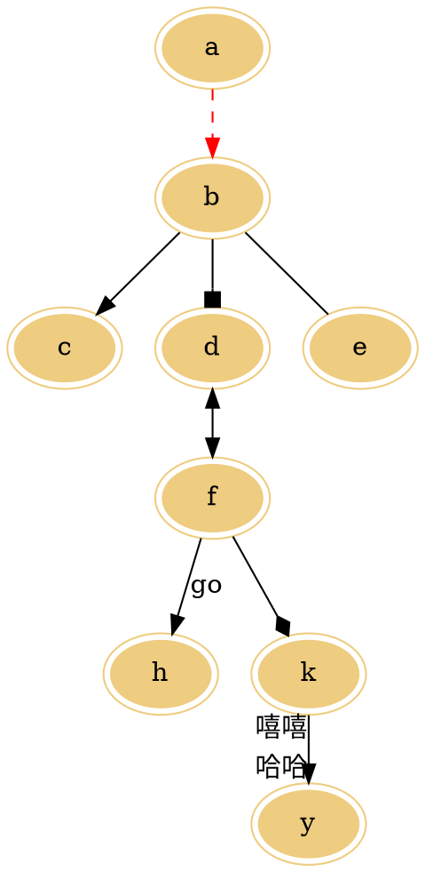

<hr>
<br>

### 无向图
> 代码：
\```dot
graph g{
   edge[style=dashed];      //定义边的样式，虚线
   a--b [color=red];        //定义边的颜色，红色 
}
\```

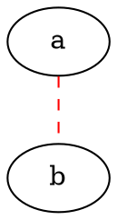


<hr><br>

### 子图
> 代码：
\```dot
digraph abc{
    node [shape="record"];
    edge [style="dashed"];
    a [style="filled"]
    b;
    //==子图==
    subgraph cluster_cd{
        label="c and d";
        bgcolor="mintcream";
        c;
        d;
    }
    //...
    a->b;
    b->d;
    c->d [color="red"]
}
\```


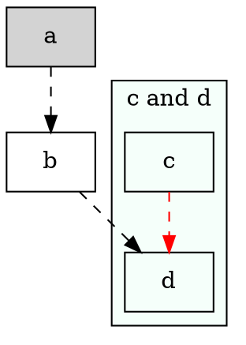

> 子图的名称必须以cluster开头，否则graphviz无法识别。


<hr><br>

### 数据结构的可视化
在实际开发中，经常要用到的是对复杂数据结构的描述，graphviz提供完善的机制来绘制此类图形。

一个hash表的数据结构

```dot
struct st_st_hash_type{
    int (*compare) ();
    int (*hash) ();
};

struct st_table_entry{
    unsigned int hash;
    char *key;
    char *record;
    st_table_entry *next;
}

struct st_table{
    struct st_hash_type *type;
    int num_bins;     //插入 count*
    int num_entries;    //统计实体
    struct st_table_entry **bins;
}


digraph st2{
    fontname="Verdana";
    fontsize=10;
    rankdir=TB;

    node [fontname="Verdana" ,fontsize=10,color="skyblue",shape="record"];

    edge [fontname="Verdana",fontsize=10,color="crimson",style="solid"];

    st_has_type [label="{<head>st_hash_type|(*compare)|(*hash)}"];
    
    st_table_entry [label="{<head>st_table_entry|hash|key|record|<next>next}"];

    st_table [label="{st_table|<type>type|num_bins|num_entries|<bins>bins}"];

    st_table:bins->st_table_entry:head;
    st_table:type->st_hash_type:head;

    st_table_entry:next->st_table_entry:head [style="dashed",color="forestgreen"];
}
```